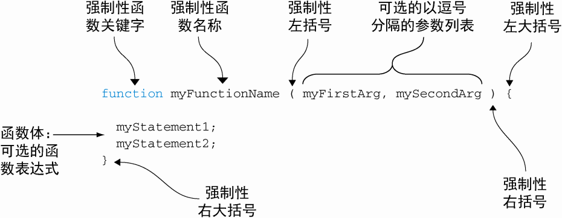
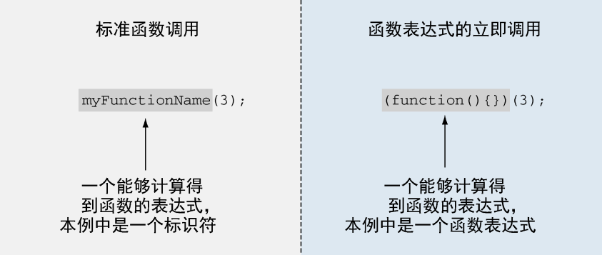
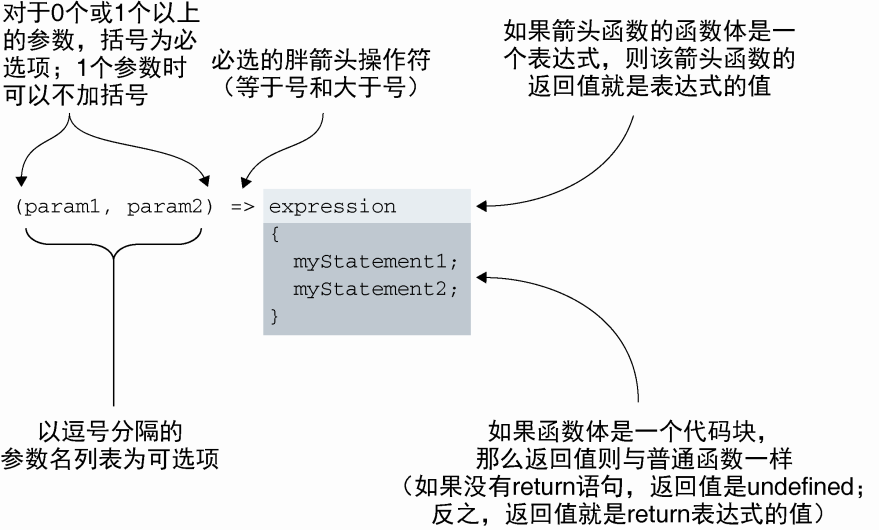
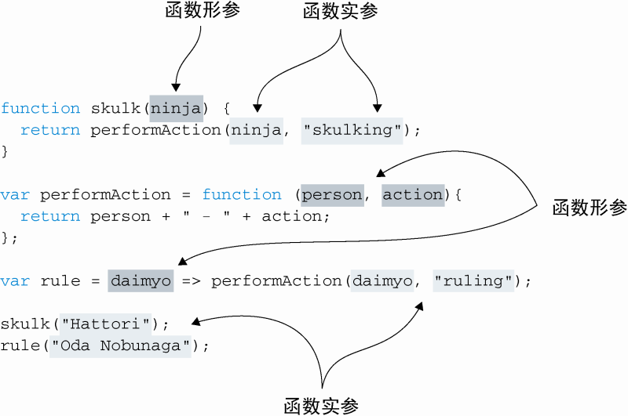

# 第 3 章　新手的第一堂函数课：定义与参数

## 3.1 函数式的不同点到底是什么

### 3.1.1 函数是第一类对象

JavaScript 中函数拥有对象的所有能力，也因此函数可被作为任意其他类型对象来对待。当我们说函数是第一类对象的时候，就是说函数也能够实现以下功能。

-   通过字面量创建

```js
function ninjaFunction() {}
```

-   赋值给变量，数组项或其他对象的属性

```js
var ninjaFunction = function() {};  //为变量赋值一个新函数
ninjaArray.push（function(){}）;  //向数组中增加一个新函数
ninja.data = function(){};　  //给某个对象的属性赋值为一个新函数
```

-   作为函数的参数来传递

```js
function call（ninjaFunction）{
　ninjaFunction();
}
call（function(){}）; //一个新函数作为参数传递给函数
```

-   作为函数的返回值

```js
function returnNewNinjaFunction() {
	return function() {} //返回一个新函数
}
```

-   具有动态创建和分配的属性

```js
var ninjaFunction = function() {}
ninjaFunction.ninja = 'Hanzo' //为函数增加一个新属性
```

### 3.1.2 回调函数

每当我们建立了一个将在随后调用的函数时，无论是在事件处理阶段通过浏览器还是通过其他代码，我们都是在建立一个回调（callback）。这个术语源自于这样一个事实，即在执行过程中，我们建立的函数会被其他函数在稍后的某个合适时间点“再回来调用”。

## 3.2 函数作为对象的乐趣

### 3.2.1 存储函数

一般来说，管理回调函数集合时，我们并不希望存在重复函数，否则一个事件会导致同一个回调函数被多次调用。

一种显著有效的简单方法是把所有函数存入一个数组，通过循环该数组来检查重复函数。不过这种方法的性能比较差，我们可以用函数的属性，用恰当的复杂度来实现它。

```js
// 存储唯一函数集合
var store = {
	nextId: 1, //跟踪下一个要被复制的函数
	cache: {}, //使用一个对象作为缓存，我们可以在其中存储函数
	add: function(fn) {
		if (!fn.id) {
      fn.id = this.nextId++
      this.cache(fn.id)=fn
      return true
		}
	} //仅当函数唯一时，将该函数加入缓存
}

function ninja(){
  assert(store.add(ninja),"Function was safely added.")
  assert(!store.add(ninja),"But it was only added once.")
}
ninja()
// 执行结果
//Function was safely added.
// But it was only added once.
```

### 3.2.2 自记忆函数

当函数计算得到结果时就将该结果按照参数存储起来。
采用这种方式时，如果另外一个调用也使用相同的参数，我们则可以直接返回上次存储的结果而不是再计算一遍。像这样避免既重复又复杂的计算可以显著地提高性能。对于动画中的计算、搜索不经常变化的数据或任何耗时的数学计算来说，记忆化这种方式是十分有用的。

```js
// 计算先前得到的值---isPrime（是不是质数）
function isPrime(value) {
	if (!isPrime.answers) {
		isPrime.answers = {}
	} //创建缓存
	if (isPrime.answers[value] !== undefined) {
		return isPrime.answers[value]
	} //检查缓存的值
	var prime = value !== 0 && value !== 1 //1 is not a prime
	for (var i = 2; i < value; i++) {
		if (value % i === 0) {
			prime = false
			break
		}
	}
	return (isPrime.answers[value] = prime) //存储计算的值
}

assert(isPrime(5), '5 is prime!')
assert(isPrime.answers[5], 'The answer was cached!') //测试该函数是否正常工作
```

## 3.3 函数定义

js 提供集中定义函数的方式，可以分为 4 类：

-   函数声明（function declarations）和函数表达式（function expressions）
-   箭头函数（lambda 函数）
-   函数构造函数

```js
new Function('a', 'b', 'return a + b')
```

-   生成器函数

```js
function* myGen() {
	yield 1
}
```

### 3.3.1 函数声明和函数表达式

函数声明



    函数声明是独立的，是独立的 JavaScript 代码块

```js
function a() {} //函数声明
```

函数表达式

    这种总是其他表达式的一部分的函数（作为赋值表达式的右值，或者作为其他函数的参数）叫作函数表达式。

```js
var a = function() {} //函数表达式
```

---

函数声明与函数表达式的不同

> 1.函数声明和函数表达式在代码中的位置不同以外
>
> 2.对于函数声明来说，函数名是强制性的，而对于函数表达式来说，函数名则完全是可选的
>
> 3.函数声明必须具有函数名是因为它们是独立语句。一个函数的基本要求是它应该能够被调用，所以它必须具有一种被引用方式，于是唯一的方式就是通过它的名字。

立即函数



使用一元操作符也可到达立即立即调用

```js
;+(function() {})()
;-(function() {})()
!(function() {})()
~(function() {})()
```

> 不同于用加括号的方式区分函数表达式和函数声明，这里我们使用一元操作符`+、-、!和~`。这种做法也是用于向 JavaScript 引擎指明它处理的是表达式，而不是语句。从计算机的角度来讲，注意应用一元操作符得到的结果没有存储到任何地方并不重要，只有调用 IIFE 才重要。

### 3.3.2 箭头函数



<center>箭头函数的语法</center>

## 3.4 函数的实参和形参

`形参（parameter）`是我们定义函数时所列举的变量
`实参（argument）`是我们调用函数时所传递给函数的值



<center>函数形参和函数实参的不同点</center>

### 3.4.1 剩余参数

只有函数的最后一个参数才能是剩余参数。试图把`省略号(...扩展运算符)`放在不是最后一个形参的任意形参之前都会报错，错误以 SyntaxError: parameter after rest parameter 的形式展现。

### 3.4.2 默认参数

es6 之前：对参数逐一判断，为空则赋值
es6：`参数=默认值`

> 尽管 JavaScript 提供了这样的功能，我们依然强烈建议您在使用的时候要小心。在我们看来，它不能提高代码的可读性，故而无论何时都需要避免这种写法。不过适当地使用默认参数——避免空值，或作为配置函数的简单标记能够带来简洁优雅的代码。

## 3.5 小结

-   把 JavaScript 看作函数式语言你就能书写复杂代码。
-   作为第一类对象，函数和 JavaScript 中其他对象一样。类似于其他对象类型，函数具有以下功能。
    -   通过字面量创建。
    -   赋值给变量或属性。
    -   作为函数参数传递。
    -   作为函数的结果返回。
    -   赋值给属性和方法。
-   回调函数是被代码随后“回来调用”的函数，它是一种很常用的函数，特别是在事件处理场景下。 - 函数具有属性，而且这些属性能够被存储任何信息，我们可以利用这个特性来做很多事情；例如：
    -   可以在函数属性中存储另一个函数用于之后的引用和调用。
    -   可以用函数属性创建一个缓存（记忆），用于减少不必要的计算。
-   有很多不同类型的函数：函数声明、函数表达式、箭头函数以及函数生成器等。
-   函数声明和函数表达式是两种最主要的函数类型。函数声明必须具有函数名，在代码中它也必须作为一个独立的语句存在。函数表达式可以不必有函数名，但此时它就必须作为其他语句的一部分。
-   箭头函数是 JavaScript 的一个新增特性，这个特性让我们可以使用更简洁的方式来定义函数。
-   形参是函数定义时列出的变量，而实参是函数调用时传递给函数的值。
-   函数的形参列表和实参列表长度可以不同。
    -   未赋值的形参求值得到 undefined。
    -   传入的额外实参不会被赋给任何一个命名形参。
-   剩余参数和默认参数是 JavaScript 的新特性。
    -   剩余参数——不与任何形参名相匹配的额外实参可以通过剩余参数来引用。
    -   默认参数——函数调用时，若没传入参数，默认参数可以给函数提供缺省的参数值。
