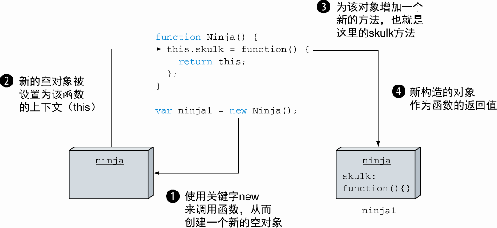

# 第 4 章 函数进阶：理解函数调用

本章包括以下内容：

-   函数中两个隐含的参数：`arguments` 和 `this`
-   调用函数的不同方式
-   处理函数上下文的问题

> 参数 `this` 表示被调用函数的上下文对象，而 `arguments` 参数表示函数调用过程中传递的所有参数。这两个参数在 JavaScript 代码中至关重要。参数 this 是 JavaScript 面向对象编程的基本要素之一，通过 arguments 参数我们可以访问函数调用过程中传递的实际参数。

## 4.1 使用隐式函数参数

除了在函数定义中显式声明的参数之外，函数调用时还会传递两个隐式的参数：`arguments` 和 `this`。

### 4.1.1 arguments 参数

`arguments` 参数是传递给函数的所有参数集合。无论是否有明确定义对应的形参，通过它都可以访问到函数的所有参数。

arguments 是一个类数组，避免将 arguments 作为参数的别名

### 4.1.2 this 参数：函数上下文

`this` 参数的指向不仅是由定义函数的方式和位置决定的，同时还严重受到函数调用方式的影响。真正理解 this 参数是面向对象 JavaScript 编程的基础

## 4.2 函数调用

### 4.2.1 作为函数直接被调用

    如果一个函数没有作为方法、构造函数或者通过 apply 和 call 调用的话，我们就称之为作为函数被直接调用。

```js
function ninja() {}
ninja() //　函数定义作为函数被调用
var samurai = function() {}
samurai() //　函数表达式作为函数被调用
;(function() {})() //　会被立即调用的函数表达式，作为函数被调用
```

**当以这种方式调用时，函数上下文（this 关键字的值）有两种可能性：**

-   在非严格模式下，它将是全局上下文（window 对象）;
-   而在严格模式下，它将是 undefined。

### 4.2.2 作为方法被调用

    当一个函数被赋值给一个对象的属性，并且通过对象属性引用的方式调用函数时，函数会作为对象的方法被调用。

**当以这种方式调用时，this 指向当前宿主对象**

### 4.2.3 作为构造函数调用

调用构造函数会发生一系列操作，使用关键字`new`调用函数会触发以下几个动作：

1. 创建一个新的空对象
2. 该对象作为 this 参数传递给构造函数，从而成为构造函数的函数上下文
3. 新构造的对象作为 new 运算符的返回值



<center>当使用关键字new调用函数时，会创建一个空的对象实例并将其设置为构造函数的上下文（this参数）</center>

### 4.2.4 使用 apply 和 call 方法调用


> 传入 call 和 apply 方法的第一个参数都会被作为函数上下文，不同处在于后续的参数。apply 方法只需要一个额外的参数，也就是一个包含参数值的数组；call 方法则需要传入任意数量的参数值，这些参数将用作函数的实参

## 4.3 解决函数上下文的问题

### 4.3.1 使用箭头函数绕过函数上下文

    箭头函数自身不含上下文，从定义时的所在函数继承上下文。

**注意** `箭头函数与对象字面量声明`的坑,如下例子：

```html
<button id="test">Click Me!</button>
<script>
	assert(this === window, "this === window");　　//　全局代码中的this指向全局window对象
	var button = {　　使用对象字面量定义button
	　 clicked: false,
	　 click: () => {　　//　箭头函数是对象字面量的属性
	　　 this.clicked = true;
	　　 assert(button.clicked,"The button has been clicked");　　//　验证是否单击按钮
	　　 assert(this === window, "In arrow function this === window");　　//　箭头函数中的this指向全局window对象
	　　 assert(window.clicked, "clicked is stored in window");　　//　 clicked属性存储在window对象上
	　}
	 }
	 var elem = document.getElementById("test");
	 elem.addEventListener("click", button.click);
</script>
```

> 箭头函数在创建时确定了 `this` 的指向。由于 click 箭头函数是作为对象字面量的属性定义的，对象字面量在全局代码中定义，因此，箭头函数内部 this 值与全局代码的 this 值相同。

### 4.3.2 使用 bind 方法

> 无论使用哪种方法调用，bind 方法创建的新函数与原始函数的函数体相同，新函数被绑定到指定的对象上。

## 4.4 小结

-   当调用函数时，除了传入在函数定义中显式声明的参数之外，同时还传入两个隐式参数：arguments 与 this。
    -   arguments 参数是传入函数的所有参数的集合。具有 length 属性，表示传入参数的个数，通过 arguments 参数还可获取那些与函数形参不匹配的参数。在非严格模式下，arguments 对象是函数参数的别名，修改 arguments 对象会修改函数实参，可以通过严格模式避免修改函数实参。
    -   this 表示函数上下文，即与函数调用相关联的对象。函数的定义方式和调用方式决定了 this 的取值。
-   函数的调用方式有 4 种。
    -   作为函数调用：skulk()。
    -   作为方法调用：ninja.skulk()。
    -   作为构造函数调用：new Ninja()。
    -   通过 apply 与 call 方法调用：skulk.apply(ninja)或 skulk.call(ninja)。
-   函数的调用方式影响 this 的取值。
    -   如果作为函数调用，在非严格模式下，this 指向全局 window 对象；在严格模式下，this 指向 undefined。
    -   作为方法调用，this 通常指向调用的对象。
    -   作为构造函数调用，this 指向新创建的对象。
    -   通过 call 或 apply 调用，this 指向 call 或 apply 的第一个参数。
    -   箭头函数没有单独的 this 值，this 在箭头函数创建时确定。
-   所有函数均可使用 bind 方法，创建新函数，并绑定到 bind 方法传入的参数上。被绑定的函数与原始函数具有一致的行为。
