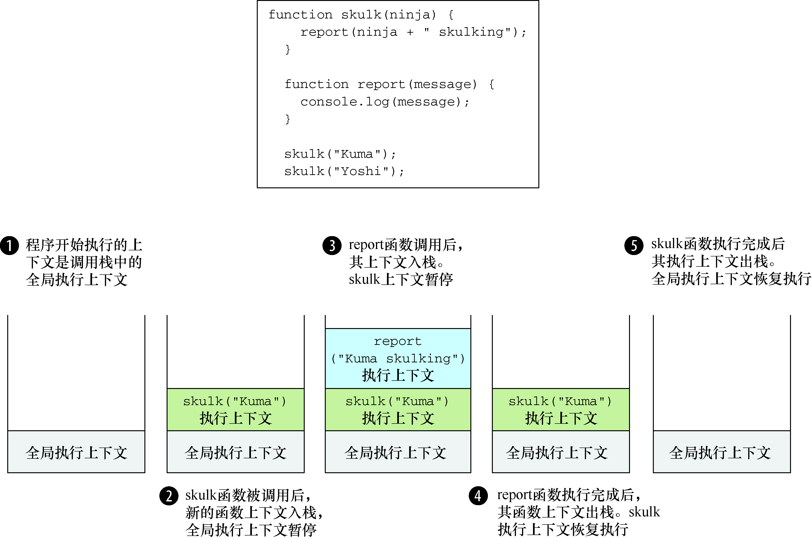
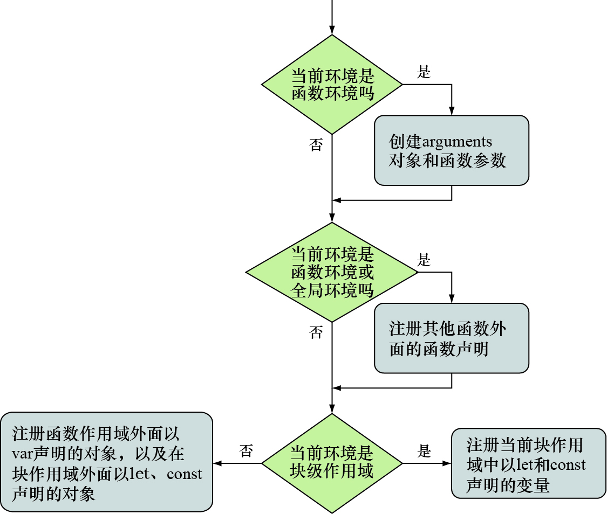

# 第 5 章 精通函数：闭包和作用域

**本章包括以下内容**

-   使用闭包简代码
-   使用执行上下文跟踪 js 程序的执行
-   使用词法环境（Lexical Environment）跟踪变量的作用域
-   理解变量的类型
-   探讨闭包的工作原理

## 5.1 理解闭包

    闭包允许函数访问并操作函数外部的变量。只要变量或函数存在与声明函数时的作用域内，闭包即可使函数能够访问这些变量或函数。

**一个简单的闭包**

```js
var outerValue = 'ninja' //在全局作用域中定义一个变量
function outerFunction() {
	assert(outerValue === 'ninja', 'I can see the ninja.')
} //在全局作用域中声明函数
outerFunction() //执行
```

**另一个闭包的例子**

```js
var outerValue = 'samurai'
var later //声明一个空变量，稍后在后面的代码中使用

function outerFunction() {
	var innerValue = 'ninja' //在函数内部声明一个值，该值在作用域局限于函数内部，在函数外部不允许访问

	function innerFunction() {
		assert(outerValue === 'samurai', 'I can see the samurai.')
		assert(innerValue === 'ninja', 'I can see the ninja.')
	} //在outerFunction函数中声明一个内部函数，声明该内部函数时，innerValue是在内部函数的作用域内
	later = innerFunction //将内部函数innerFunction的引用存储在变量later上，因为later在全局作用域内，所以我们可以对它进行调用
}

outerFunction() //调用outerFunction函数，创建内部函数innerFunction，并将内部函数赋值给变量later

later() //通过later调用内部函数。我们不能直接调用内部函数，因为它的作用域（和innerValue一起）被限制在外部函数outerFunction之内
```

## 5.2 使用闭包

### 5.2.1 封装私有变量

**使用闭包模拟私有变量**

```js
function Ninja() {
	//定义Ninja构造函数
	var feints = 0 //在构造函数内部声明一个变量，因为所声明的变量的作用域局限于构造函数的内部，所以它是一个“私有”变量。我们使用该变量统计Ninja佯攻的次数
	this.getFeints = function() {
		return feints //创建用于访问计数变量feints的方法。由于在构造函数外部的代码是无法访问feints变量的，这是通过只读形式访问该变量的常用方法
	}
	this.feint = function() {
		feints++
	} //为feints变量声明一个累加方法。由于feints为私有变量，在外部是无法累加的，累加过程则被限制在我们提供的方法中
}

var ninja1 = new Ninja() //现在开始测试，首先创建一个Ninja的实例
ninja1.feint() //调用feint方法，通过该方法增加Ninja的佯攻次数
assert(
	ninja1.feints === undefined, //验证我们无法直接获取该变量值
	'And the private data is inaccessible to us.'
)
assert(ninja1.getFeints() === 1, "We're able to access the internal feint count.") //虽然我们无法直接对feints变量赋值，但是我们仍然能够通过getFeints方法操作该变量的值
var ninja2 = new Ninja()
assert(ninja2.getFeints() === 0, 'The second ninja object gets its own feints variable.') //当我们通过ninja构造函数创建一个新的ninja2实例时，ninja2对象则具有自己私有的feints变量
```

### 5.2.2 回调函数

**在 interval 的回调函数中使用闭包**

```html
<!-- 创建用于展示动画的DOM元素 -->
<div id="box1">First Box</div>
<script>
	function animateIt(elementId) {
		var elem = document.getElementById(elementId) //在动画函数animateIt内部，获取DOM元素的引用
		var tick = 0 //创建一个计时器用于记录动画执行的次数
		var timer = setInterval(function() {
			//创建并启动一个JavaScript内置的计时器，传入一个回调函数
			if (tick < 100) {
				elem.style.left = elem.style.top = tick + 'px'
				tick++
			} //每隔10毫秒调用一次计时器的回调函数，调整元素的位置100次
			else {
				clearInterval(timer)
				assert(
					tick === 100, //执行了100次之后，停止计时器，并验证我们还可以看到与执行动画有关的变量
					'Tick accessed via a closure.'
				)
				assert(elem, 'Element also accessed via a closure.')
				assert(timer, 'Timer reference also obtained via a closure.')
			}
		}, 10) //setInterval函数的持续时间为10毫秒，也就是说回调函数每隔10毫秒调用一次
	}
	animateIt('box1') //全部设置完成之后，我们可以执行动画函数并查看动画效果
</script>
```

## 5.3 通过执行上下文来跟踪代码

JavaScript 代码有两种类型：一种是全局代码，在所有函数外部定义；一种是函数代码，位于函数内部。

既然具有两种类型的代码，那么就有两种执行上下文：全局执行上下文和函数执行上下文。二者最重要的差别是：全局执行上下文只有一个，当 JavaScript 程序开始执行时就已经创建了全局上下文；而函数执行上下文是在每次调用函数时，就会创建一个新的。

**创建执行上下文**

```js
function skulk(ninja) {
	report(ninja + ' skulking') //一个函数调用另外一个函数
}

function report(message) {
	console.log(message)
} //通过内置的console.log方法发送消息
skulk('Kuma')
skulk('Yoshi') //在全局中分别调用两个函数
```



<center> 执行上下文栈的行为</center>

**执行上方例子时，执行上下文的行为如下**

1． 每个 JavaScript 程序只创建一个全局执行上下文，并从全局执行上下文开始执行（在单页应用中每个页面只有一个全局执行上下文）。当执行全局代码时，全局执行上下文处于活跃状态。

2． 首先在全局代码中定义两个函数：skulk 和 report，然后调用 skulk("Kuma")。由于在同一个特定时刻只能执行特定代码，所以 JavaScript 引擎停止执行全局代码，开始执行带有 Kuma 参数的 skulk 函数。创建新的函数执行上下文，并置入执行上下文栈的顶部。

3． skulk 函数进而调用 report 函数。又一次因为在同一个特定时刻只能执行特定代码，所以，暂停 skulk 执行上下文，创建新的 Kuma 作为参数的 report 函数的执行上下文，并置入执行上下文栈的顶部。

4． report 通过内置函数 console.log 打印出消息后，report 函数执行完成，代码又回到了 skulk 函数。report 执行上下文从执行上下文栈顶部弹出，skulk 函数执行上下文重新激活，skulk 函数继续执行。

5． skulk 函数执行完成后也发生类似的事情：skulk 函数执行上下文从栈顶端弹出，重新激活一直在等待的全局执行上下文并恢复执行。JavaScript 的全局代码恢复执行。

> skulk 函数第二次执行时，整个过程是类似的，只是参数变成了 Yoshi。分别创建新的函数执行上下文 skulk（"Yoshi"）和 report（"Yoshi skulking"），并依次置入执行上下文栈的顶部。每个函数执行完成时，对应的函数上下文从执行上下文栈顶部弹出。

## 5.4 使用词法环境跟踪变量的作用域

**词法环境（lexical environment）**是 js 引擎内部用来跟踪标识符与特定变量之间的映射关系。

> 词法环境是 js 作用域的内部实现机制，通常称为作用域（scope）。

### 5.4.1 代码嵌套

    词法环境主要基于代码嵌套，通过代码嵌套可以实现代码结构包含另一代码结构。

### 5.4.2 代码嵌套与词法环境

    除了跟踪局部变量、函数声明、函数的参数和词法环境外，还有必要跟踪外部（父级）词法环境。

## 5.5 理解 JS 的变量类型

    	在js中，我们可以通过3个关键字定义变量：`var`、`let`和`const`。这3个关键字有两点不同：可变性，与词法环境的关系。

### 5.5.1 变量可变性

-   const 不可变
-   var 和 let

### 5.5.2 定义变量的关键字与词法环境

-   var 是在距离最近的函数内部或是再全局词法环境中定义的
-   let、const 直接在最近的词法环境中定义变量。（块级变量）

### 5.5.3 在词法环境中注册标识符

1. 如果是创建一个函数环境，那么创建形参及函数参数的默认值。如果是非函数环境，将跳过此步骤。
2. 如果是创建全局或函数环境，就扫描当前代码进行函数声明（不会扫描其他函数的函数体），但是不会扫描函数表达式或箭头函数。对于所找到的函数声明，将创建函数，并绑定到当前环境与函数名相同的标识符上。若该标识符已经存在，那么该标识符的值将被重写。如果是块级作用域，将跳过此步骤。
3. 扫描当前代码进行变量声明。在函数或全局环境中，找到所有当前函数以及其他函数之外通过 var 声明的变量，并找到所有在其他函数或代码之外通过 let 和 const 定义的变量。在块级环境中，仅查找当前块中通过 let 和 const 定义的变量。对于所查找到的变量，若该标识符不存在，进行注册并将其初始化为 undefined。若该标识符已经存在，将保留其值。

处理过程如下图：


<center>注册标识符的过程取决于环境的类型</center>

## 5.7 小结

-   通过闭包可以访问创建闭包时所处环境中的全部变量。闭包为函数创建时所处的作用域中的函数和变量，创建“安全气泡”。通过这种的方式，即使创建函数时所处的作用域已经消失，但是函数仍然能够获得执行时所需的全部内容。
-   我们可以使用闭包的这些高级功能：
    -   通过构造函数内的变量以及构造方法来模拟对象的私有属性。
    -   处理回调函数，简化代码。
-   JavaScript 引擎通过执行上下文栈（调用栈）跟踪函数的执行。每次调用函数时，都会创建新的函数执行上下文，并推入调用栈顶端。当函数执行完成后，对应的执行上下文将从调用栈中推出。
-   JavaScript 引擎通过词法环境跟踪标识符（俗称作用域）。
-   在 JavaScript 中，我们可以定义全局级别、函数级别甚至块级别的变量。
-   可以使用关键字 var、let 与 const 定义变量：
    -   关键字 var 定义距离最近的函数级变量或全局变量。
    -   关键字 let 与 const 定义距离最近级别的变量，包括块级变量。块级变量在 ES6 之前版本的 JavaScript 中是无法实现的。此外，通过关键字 const 允许定义只能赋值一次的变量。
-   闭包是 JavaScript 作用域规则的副作用。当函数创建时所在的作用域消失后，仍然能够调用函数。
