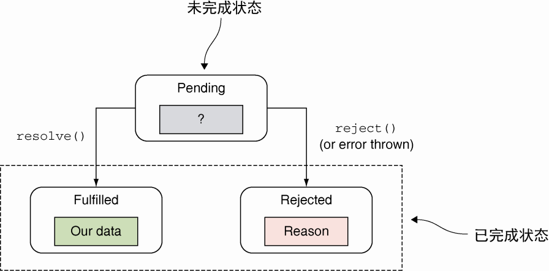

# 第 6 章 未来的函数：生成器和 promise

**本章包括以下内容**

-   通过生成器让函数持续执行
-   通用 promise 处理异步任务
-   使用生成器（generator）和 promise 书写优雅代码

生成器是一种特殊类型的函数。当从头到尾运行标准函数时，它最多只生成一个值。然而生成器函数会在几次运行请求中暂停，因此每次运行都可能会生成一个值。

## 6.1 使用生成器和 promise 编写优雅的异步代码

## 6.2 使用生成器函数

## 6.3 使用 Promise

### 6.3.1 　理解简单回调函数所带来的问题

使用异步代码的原因在于不希望在执行长时间任务的时候，应用程序的执行被阻塞（影响用户体验）。当前，通过使用回调函数解决这个问题：对长时间执行的任务提供一个函数，当任务结束后会调用该回调函数。

### 6.3.2 　深入研究 promise



<center> promise的状态</center>

### 6.3.3 　拒绝 promise

拒绝一个 promise 有两种方式：`显式拒绝`，即在一个 promise 的执行函数中调用传入的 reject 方法；`隐式拒绝`，正处理一个 promise 的过程中抛出了一个异常。

**显示拒绝 promise**

```js
const promise = new Promise((resolve, reject) => {
	reject('Explicitly reject a promise!') //可以通过调用传入的reject函数显式拒绝该promise
})

promise.then(
	() => fail("Happy path, won't be called!"),
	error => pass('A promise was explicitly rejected!') //如果promise被拒绝，则第二个回调函数error将会被调用
)
```

**链式调用 catch 方法来处理拒绝 promise**

```js
var promise = new Promise((resolve, reject) => {
	reject('Explicitly reject a promise!')
})

promise
	.then(() => fail("Happy path, won't be called!"))
	.catch(() => pass('Promise was also rejected')) //　不同于应用第二个回调函数error，我们可以对catch方法进行链式调用，并将其传入回调函数error中。最终的结束条件相同
```

**异常隐式拒绝一个 promise**

```js
const promise = new Promise((resolve, reject) => {
	//如果在处理promise时出现未处理的异常，则会被隐式地拒绝
	undeclaredVariable++
})

// 如果发生了异常，则第二个回调函数error将被调用
promise
	.then(() => fail("Happy path, won't be called!"))
	.catch(error => pass('Third promise was also rejected'))
```

### 6.3.4 Promise.all() 和 Promise.race()

-   Promise.all()
    等待列表中的所有 promise
-   Promise.race()
    一旦列表中的某一个 promise 被处理或拒绝，这个发挥的 promise 就同意会被处理或拒绝

## 6.4 把生成器和 promise 相结合

## 6.5 小结

-   生成器是一种不会在同时输出所有值序列的函数，而是基于每次的请求生成值。
-   不同于标准函数，生成器可以挂起和恢复它们的执行状态。当生成器生成了一个值后，它将会在不阻塞主线程的基础上挂起执行，随后静静地等待下次请求。
-   生成器通过在 function 后面加一个星号（`*`）来定义。在生成器函数体内，我们可以使用新的关键字 yield 来生成一个值并挂起生成器的执行。如果我们想让渡到另一个生成器中，可以使用 yield\*操作符。
-   在我们控制生成器的执行过程中，通过使用迭代器的 next 方法调用一个生成器，它能够创建一个迭代器对象。除此之外，我们还能够通过 next 函数向生成器中传入值。
-   promise 是计算结果值的一个占位符，它是对我们最终会得到异步计算结果的一个保证。promise 既可以成功也可以失败，一旦设定好了，就不能够有更多改变。
-   promise 显著地简化了我们处理异步代码的过程。通过使用 then 方法来生成 promise 链，我们就能轻易地处理异步时序依赖。并行执行多个异步任务也同样简单：仅使用 Promise.all 方法即可。
-   通过将生成器和 promise 相结合我们能够使用同步代码来简化异步任务。
