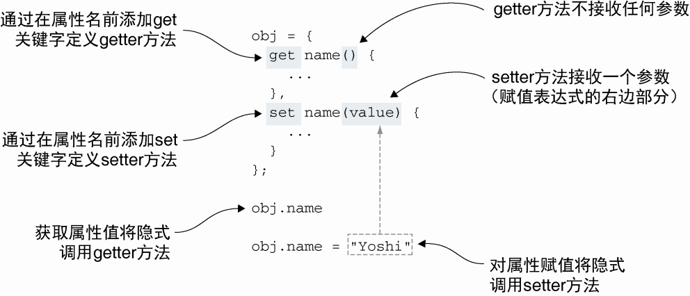

# 第 8 章 控制对象的访问

**本章包括以下内容：**

-   使用 `getter` 和 `setter` 控制访问对象的属性
-   通过代理控制对象的访问
-   使用代理解决交叉访问的问题

## 8.1 使用 getter 与 setter 控制属性的访问

**使用 getter 和 setter 保护私有属性**

```js
function Ninja() {
	let skillLevel //定义私有变量skillLevel

	this.getSkillLevel = () => skillLevel //getter方法控制对私有变量skillLevel的访问

	this.setSkillLevel = value => {
		skillLevel = value
	} //settet 方法控制对私有变量skillLevel的赋值
}

const ninja = new Ninja()
ninja.setSkillLevel(100) //通过setter方法为skillLevel变量赋值

assert(ninja.getSkillLevel() === 100, 'Our ninja is at level 100!') //通过getter方法获取skillLevel变量的值
```

### 8.1.1 定义 getter 和 setter

**js 中，可以通过两种方式定义 getter 和 setter**

-   通过对象字面量定义，或在 es6 中的 class 中定义
-   通过使用内置的 Object.defineProperty 方法

**在对象字面量中定义 getter 和 setter**

```js
const ninjaCollection = {
	ninjas: ['Yoshi', 'Kuma', 'Hattori'],
	get firstNinjas() {
		report('Getting firstNinja')
		return this.ninjas[0]
	}, //定义firstNinjas的getter方法，返回ninjas列表中的第一个值，并记录一条信息
	set firstNinjas(value) {
		report('Setting  firstNinja')
		this.ninjas[0] = value
	} //定义firstNinja的setter方法，设置ninjas列表中第一个值，并记录一条消息
}
assert(ninjaCollection.firstNinja === 'Yoshi', 'Yoshi is the first ninja') //如同访问标准对象属性一样访问firstNinja属性
ninjaCollection.firstNinja = 'Hachi' //如同操作标准对象属性一样为firstNinja属性赋值
assert(
	ninjaCollection.firstNinja === 'Hachi' && ninjaCollection.ninjas[0] === 'Hachi',
	'Now Hachi is the first ninja'
) //验证属性修改成功并生效
```



<center>定义getter和setter的语法，在属性名之前添加关键字set或get</center>

**在 es6 的 class 中使用 getter 和 setter**

```js
class NinjaCollection {
	constructor() {
		this.ninjas = ['Yoshi', 'Kuma', 'Hattori']
	}
	get firstNinja() {
		report('Getting firstNinja')
		return this.ninjas[0]
	}
	set firstNinja(value) {
		report('Setting firstNinja')
		this.ninjas[0] = value
	} //在ES6的class中使用getter和setter
}
const ninjaCollection = new NinjaCollection()

assert(ninjaCollection.firstNinja === 'Yoshi', 'Yoshi is the first ninja')

ninjaCollection.firstNinja = 'Hachi'

assert(
	ninjaCollection.firstNinja === 'Hachi' && ninjaCollection.ninjas[0] === 'Hachi',
	'Now Hachi is the first ninja'
)
```

> 针对指定的属性不一定需要同时定义 `getter` 和 `setter`。例如，通常我们仅提供 getter。如果在这种情况下试图写入属性值，具体的行为取决于代码是在严格模式还是非严格模式。如果在非严格模式下，对仅有 getter 的属性赋值不起作用，JavaScript 引擎默默地忽略我们的请求。另一方面，如果在严格模式下，JavaScript 引擎将会抛出异常，表明我们试图将给一个仅有 getter 没有 setter 的属性赋值。

**通过 Object.defineProoerty 定义 getter 和 setter**

```js
//定义构造函数
function Ninja() {
	let _skillLevel = 0 //定义私有变量，将通过闭包访问该变量
	Object.defineProperty(this, 'skillLevel', {
		//使用内置的Object.defi-neProperty定义属性skillLevel
		get: () => {
			report('The get method is called')
			return _skillLevel
		}, //访问属性skillLevel时将调用get方法
		set: value => {
			report('The set method is called')
			_skillLevel = value
		} //对属性skillLevel赋值时将调用set方法
	})
}

const ninja = new Ninja() //创建新的Ninja实例
assert(typeof ninja._skillLevel === 'undefined', "We cannot access a 'private' property")
assert(ninja.skillLevel === 0, 'The getter works fine!') //无法直接访问私有变量，但可以通过getter访问
ninja.skillLevel = 10
assert(ninja.skillLevel === 10, 'The value was updated') //对属性skillLevel属性赋值时隐式调用set方法
```

> 不管定义方式，getter 和 setter 允许我们定义对象属性与标准对象属性一样，但是当访问属性或对属性赋值时，将会立即调用 getter 和 setter 方法。这是一个非常有用的功能，使我们能够执行日志记录，验证属性值，甚至在发生变化时可以通知其他部分代码。

### 8.1.2 使用 getter 与 setter 校验属性值

> 当对属性赋值时，会立即调用 setter 方法。我们可以利用这一特性，在代码试图更新属性的值时实现一些行为。

**通过 setter 校验赋值**

```js
function Ninja() {
	let _skillLevel = 0

	Object.defineProperty(this, 'skillLevel', {
		get: () => _skillLevel,
		set: value => {
			if (!Number.isInteger(value)) {
				throw new TypeError('Skill level should be a number')
			} //校验传入的值是否是整型。如果不是，则抛出异常
			_skillLevel = value
		}
	})
}

const ninja = new Ninja()

ninja.skillLevel = 10
assert(ninja.skillLevel === 10, 'The value was updated') //我们可以将整型值赋值给属性skillLevel
try {
	ninja.skillLevel = 'Great'
	fail('Should not be here')
} catch (e) {
	pass('Setting a non-integer value throws an exception')
} //试图将非整型值(如字符串)赋值给属性skillLevel，将从setter方法抛出异常
```

### 8.1.3 使用 getter 与 setter 定义如何计算属性值

## 8.2 使用代理访问控制

### 8.2.1 使用代理记录日志

### 8.2.2 使用代理检测性能

### 8.2.3 使用代理自动填充属性

### 8.2.4 使用代理实现负数组索引

### 8.2.5 代理的性能消耗

## 8.3 小结
