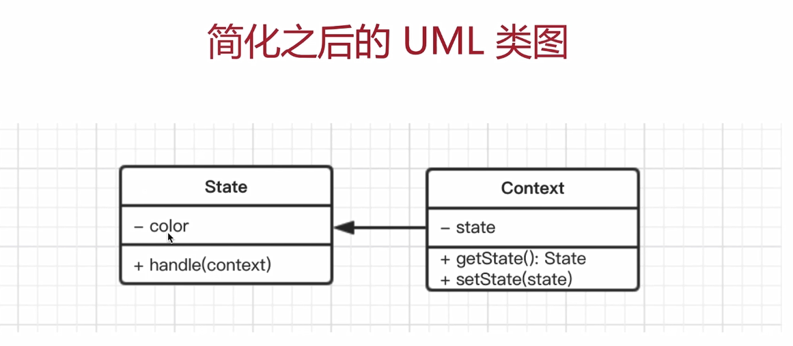

# 10. 状态模式

---

## 10.1 介绍

- 一个对象有状态变化
- 每次状态变化都会触发一个逻辑
- 不能总是用 if...else 来控制

## 10.2 UML 类图




## 10.3 示例代码

```js
// 状态（红灯、绿灯、黄灯）
class State {
  constructor(color) {
    this.color = color
  }
  handle(context) {
    console.log(`turn to ${this.color} light`)
    context.setState(this)
  }
}
// 主体
class Context {
  constructor() {
    this.state = null
  }
  // 获取状态
  getState() {
    return this.state
  }
  // 设置状态
  setState(state) {
    this.state = state
  }
}
// 测试
let context = new Context()
let green = new State('green')
let red = new State('red')
let yellow = new State('yellow')
// 绿灯亮了
green.handle(context)
console.log(context.getState())
```

## 10.4 场景

### 10.4.1 有限状态机

- 有限个状态，以及再这些状态之间的变化
- 如交通信号灯
- 开源 lib: `javascript-state-machine` [github.com/jakesgordon/javascript-state-machine](https://github.com/jakesgordon/javascript-state-machine)

代码示例：

```js
// 有限状态机-“收藏”和“取消”
// 状态机模型
import StateMachine from 'javascript-state-machine'
var fsm = new StateMachine({
  init: '收藏', // 初始状态,待收藏
  transitions: [
    {
      name: 'doStore',
      from: '收藏',
      to: '取消收藏'
    },
    {
      name: 'deleteStore',
      from: '取消收藏',
      to: '收藏'
    }
  ],
  methods: {
    // 执行收藏
    onDoStore() {
      console.log('收藏成功')
      updateText()
    },
    // 取消收藏
    onDeleteStore() {
      console.log('取消收藏')
      updateText()
    }
  }
})

let btn = document.getElementById('btn1')
brn.onClick = () => {
  if (fm.is('收藏')) {
    fsm.doStore()
  } else {
    fsm.deleteStore()
  }
}
// 更新按钮文本
function updateText() {
  btn.innerHTML = fsm.state
}
updateText()
```

### 10.4.2 写一个简单的 Promise

- Promise 三种状态：`pending` `fullfilled` `rejected`
- `pending->fullfilled` 或者 `pending-> rejected`
- 不能逆向变化

```js
import StateMachine from 'javascript-state-machine'
// 模型
var fsm = new StateMachine({
  init: 'pending',
  transitions: [
    {
      name: 'resolve',
      from: 'pending',
      to: 'fullfilled'
    },
    {
      name: 'reject',
      from: 'pending',
      to: 'reject'
    }
  ],
  methods: {
    // 成功
    onResolve(state, data) {
      // 参数：state - 当前的状态 data - fsm.resolve(xxx) 执行时传递过来的参数xxx
      data.successList.forEach((fn) => fn())
    },
    // 失败
    onReject(state, data) {
      // 参数：state - 当前的状态 data - fsm.resolve(xxx) 执行时传递过来的参数xxx
      data.failList.forEach((fn) => fn())
    }
  }
})

// 定义Promise
class MyPromise {
  constructor(fn) {
    this.successList = []
    this.failList = []

    fn(
      () => {
        // resolve函数
        fsm.resolve(this)
      },
      () => {
        // reject 函数
        fsm.reject(this)
      }
    )
  }
  then(successFn, failFn) {
    this.successList.push(successFn)
    this.failList.push(failFn)
  }
}
```

## 10.5 设计原则验证

- 将状态对象和主题对象分离，状态的变化逻辑单独处理
- 符合开放封闭原则
