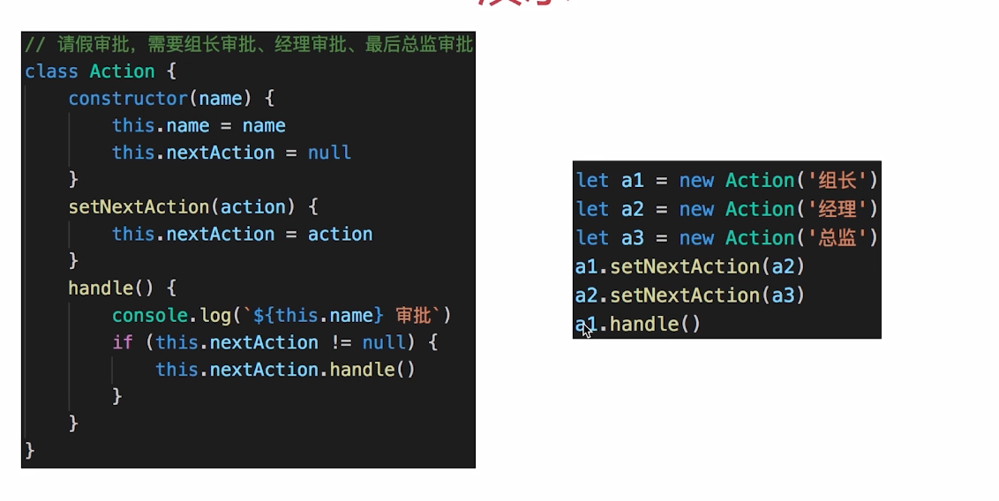
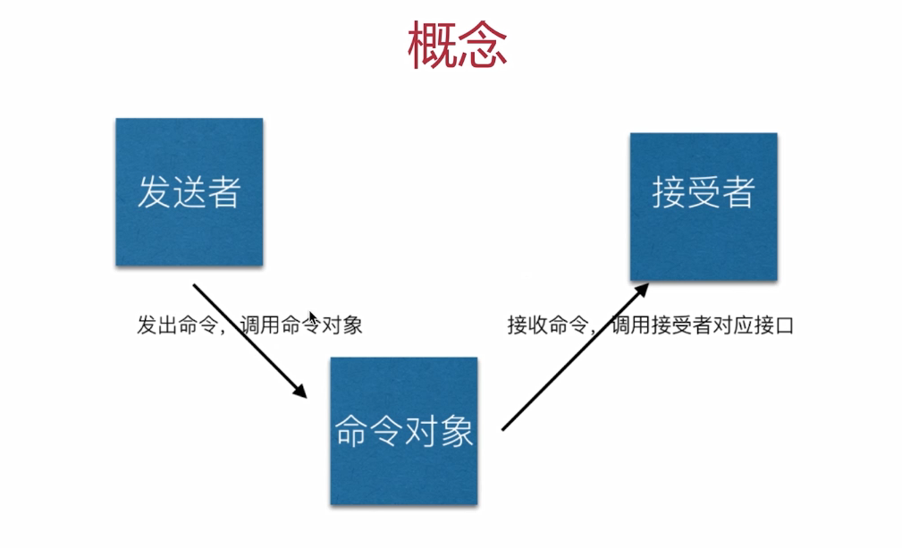
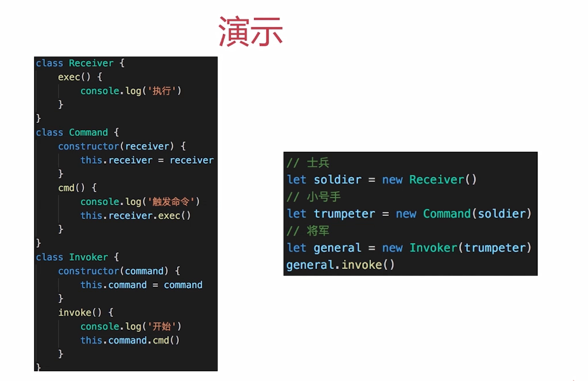
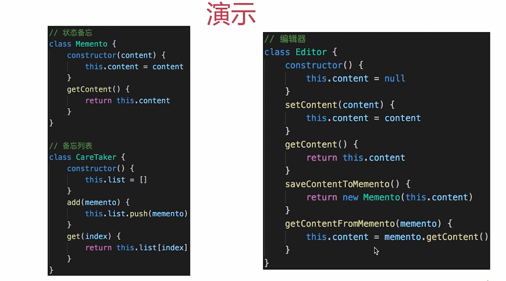
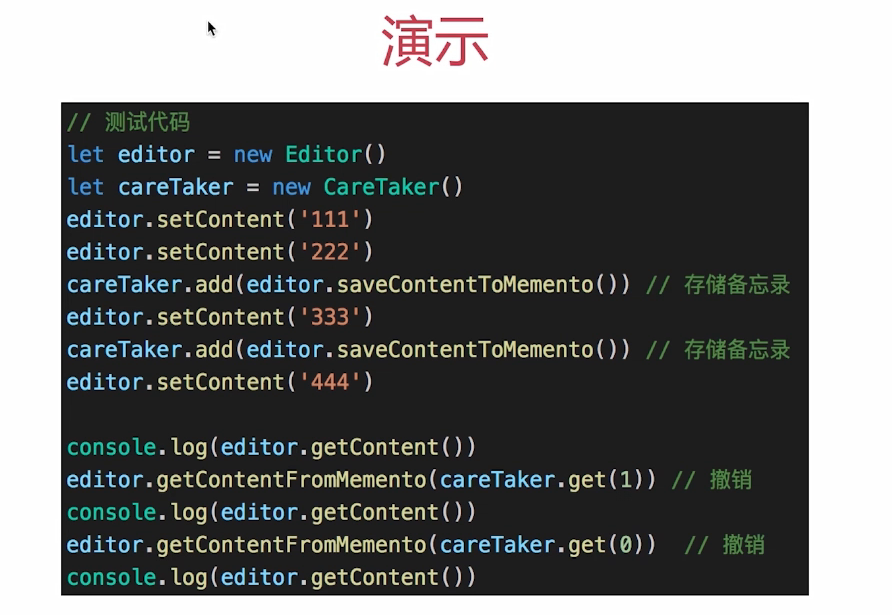
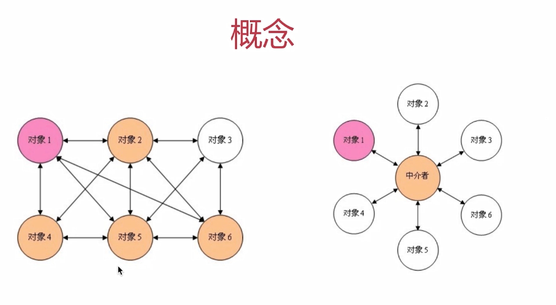
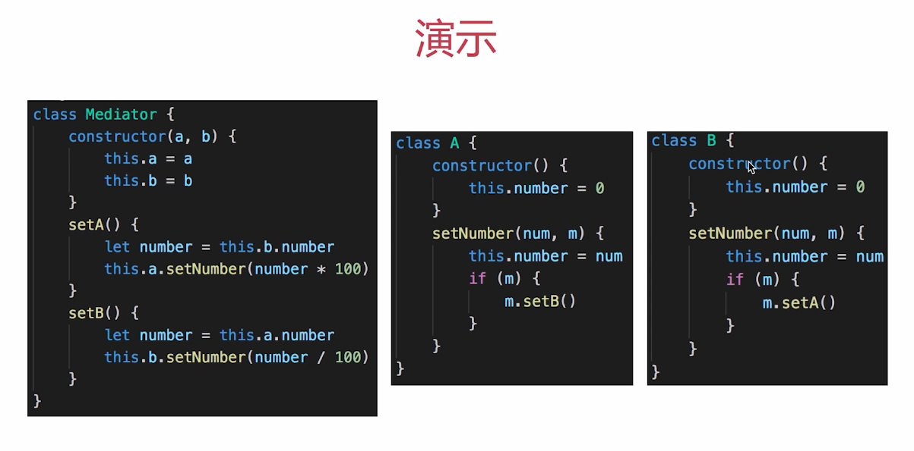
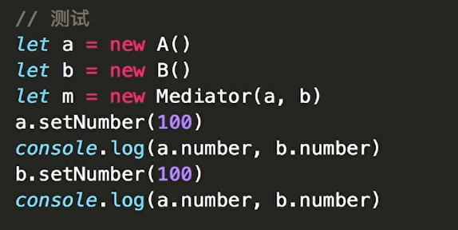

# 11. 其他设计模式

- 前端不常用
- 对应不到经典的应用场景

---

## 11.1 原型模式

- clone 自己，生成一个新对象
- JAVA 有自己的 clone 方法
- JS 中的应用 - `Object.create`

```js
let prototype = {
  getName() {
    return `${this.first} ${this.last}`
  },
  say() {
    console.log('say')
  }
}
// 基于原型创建 x
var x = Object.create(prototype)
x.first = 'A'
x.last = 'B'
console.log(x.getName())
x.say()

// 基于原型创建 y
var y = Object.create(prototype)
y.first = 'C'
y.last = 'D'
console.log(y.getName())
y.say()
```

对比 JS 中的原型 prototype

- prototype 可以理解为 es6 class 的一种底层原理
- 而 class 是实现面向对象的基础，并不是服务于某个模式

## 11.2 桥接模式

- 用于把抽象化与实现化解耦
- 使得二者可以独立变化
- 未找到 JS 中的经典应用

## 11.3 组合模式

- 生成树形结构，表示`整体-部分`关系
- 让整体和部分都具有一致的操作方式
- 虚拟 DOM 中的 vnode 是这种形式，但数据类型简单

## 11.4 享元模式

- 共享内存（主要考虑内存，而非效率）
- 相同的数据，共享使用
- （JS 中未找到经典应用场景）

## 11.5 策略模式

- 不同策略分开处理
- 避免出现大量 if else 或者 switch case

## 11.6 模板方法模式

```js
class Action {
  handle() {
    handle1()
    handle2()
    handle3()
  }
  handle1() {
    console.log(1)
  }
  handle2() {
    console.log(2)
  }
  handle3() {
    console.log(3)
  }
}
```

## 11.7 职责链模式

- 一步操作可能分为多个职责角色来完成
- 把这些角色都分开，然后用一个链串起来
- 将发起者和各个处理者进行隔离



JS 中的链接操作

- 职责链模式和业务结合较多，JS 中能联想到链式操作
- jQuery 的链式操作，Promise.then 的链式操作

## 11.8 命令模式

- 执行命令时，发布者和执行者分开
- 中间加入命令对象，作为中转站





## 11.9 备忘录模式

- 随时记录一个对象的状态变化
- 随时可以恢复之前的某个状态（如撤销功能）




## 11.10 中介者模式





## 11.11 访问者模式

- 将数据操作和数据结构进行分离
- 使用场景不多

## 11.12 解释器模式

- 描述预言语法如何定义，如何解释和编译
- 用于专业场景
