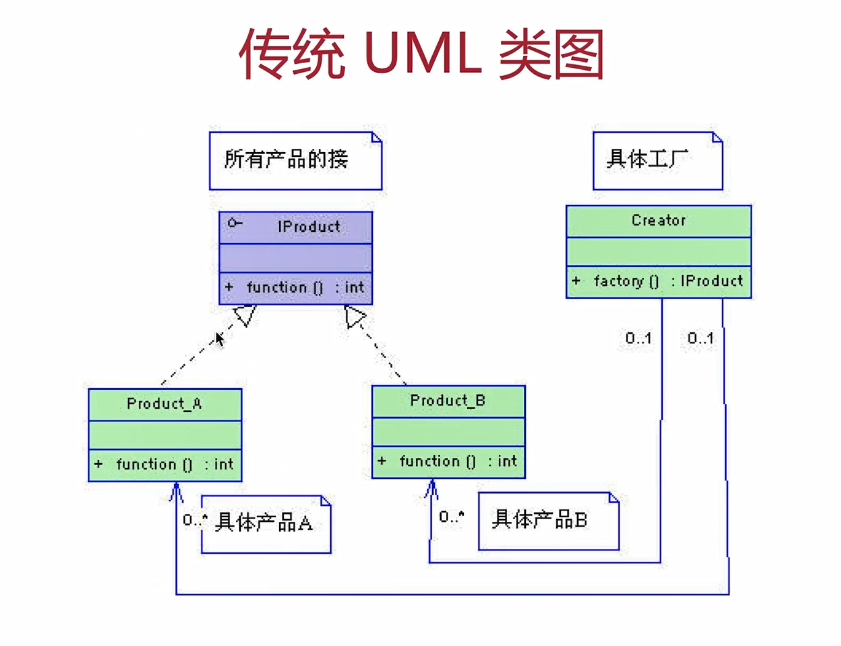
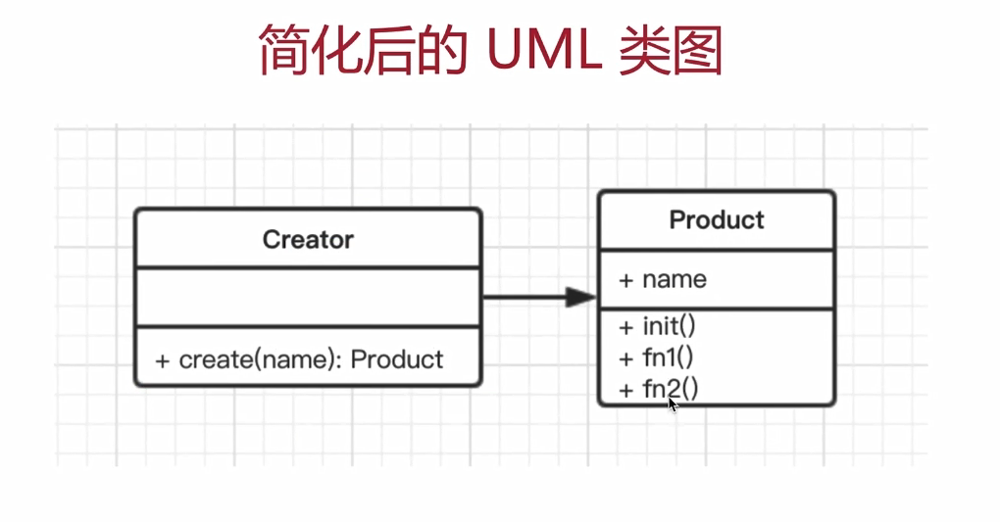

# 3. 工厂模式

---

## 3.1 介绍

- 将 `new` 操作单独封装
- 遇到 `new` 时，就要考虑是否该使用工厂模式

## 3.2 示例

- 去购买汉堡，直接点餐、取餐，不会自己亲手做
- 商店要“封装”做汉堡的工作，做好直接给买者




代码演示

```js
class Product(){
	constructor(name){
		this.name=name
	}
	init(){
		console.log('init')
	}
	fn1(){
		console.log('fn1')
	}
	fn2(){
		console.log('fn2')
	}
}
class Creator{
	create(name){
		return new Product(name)
	}
}

// 测试
let creator = new Crater()
let p1 = creator.creator('p1)
p1.init()
p1.fn1()

```

## 3.3 经典使用场景

### 3.3.1 JQuery - \$("div")

### 3.3.2 React.createElement

### 3.3.3 vue 异步组件

> **设计原则验证**
> 构造函数和创建者分离
> 符合开放封闭原则
