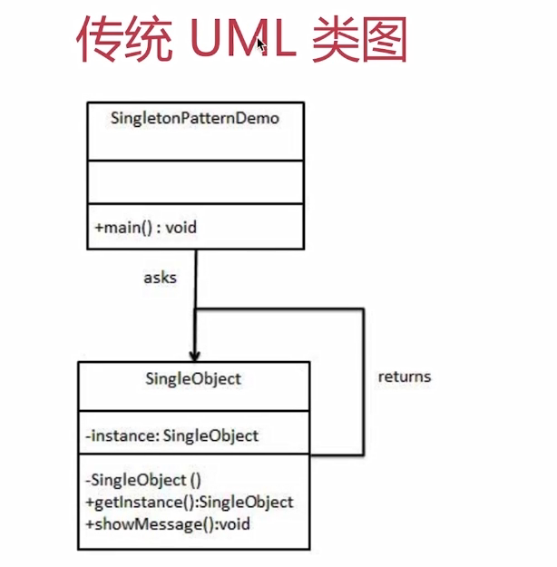
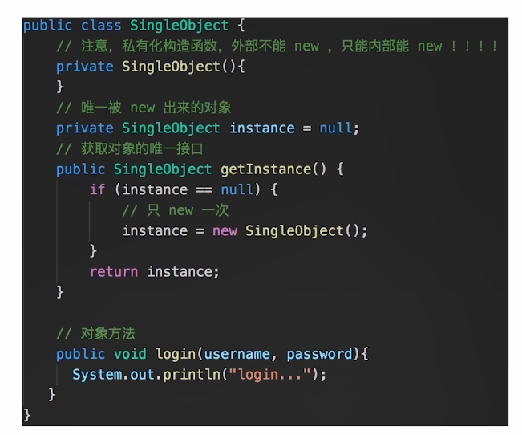
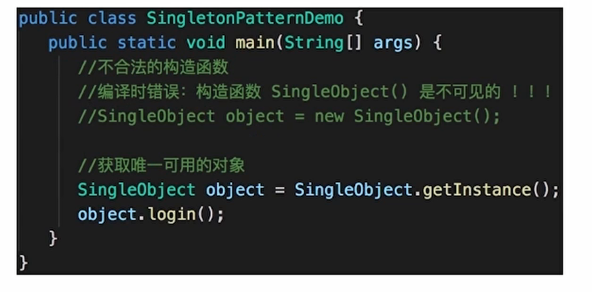

# 4. 单例模式

---

## 4.1 示例

- 登录框
- 购物车

## 4.2 UML 类图



> 说明：
> 单例模式需要用到 java 的特性( private )
> ES6 中没有(typescript 除外）
> 只能用 java 代码来演示 UML 图的内容

**java 代码演示： **

测试代码:


## 4.3 JS 使用单例模式

```js
class SingleObject {
  login() {
    console.log('login...')
  }
}
// SingleObject的静态方法 IIFE 闭包 来模拟 private
SingleObject.getInstance = (function () {
  let instance
  return function () {
    if (!instance) {
      instance = new SingleObject()
    }
    return instance
  }
})()
```

> 注意这里只能用静态函数 getInstance，不能 new SingleObject() ！！！

```js
let obj1 = SingleObject.getInstance()
obj1.login()
let obj2 = SingleObject.getInstance()
obj2.login()
console.log(obj1 === obj2) //两者完全相等
// -----------------分割线-----------------------
let obj3 = new SingleObject() //无法完全控制，通过模块化可以控制
obj3.login()
console.log(obj1 === obj3) //false
```

## 4.4 使用场景

- jQuery 只有一个\$

```js
if (window.jQuery != null) {
  return window.jQuery
} else {
  // 初始化
}
```

- 模拟登录框

```js
class LoginForm {
  constructor() {
    this.state = 'hide'
  }
  show() {
    if (this.state === 'show') {
      console.log('已经显示')
      return
    }
    this.state = 'show'
    console.log('已经显示')
  }
  hide() {
    if (this.state === 'hide') {
      console.log('已经隐藏')
      return
    }
    this.state = 'hide'
    console.log('已经隐藏')
  }
}
// 模拟单例模式
LoginForm.getInstance = (function () {
  let instance
  return function () {
    if (!instance) {
      instance = new LoginForm()
    }
    return instance
  }
})()

// 测试
let login1 = LoginForm.getInstance()
login1.show() // 显示

let login2 = LoginForm.getInstance()
login2.hide() // 隐藏

console.log('login1 === login2', login1 === login2) //true
```

- 购物车（和登录框类似）
- vuex 和 redux 中的 store

> **设计原则验证**
> 符合单一职责原则，只实例化唯一的对象
> 没法具体开放封闭原则，但是绝对不违反开放封闭原则
