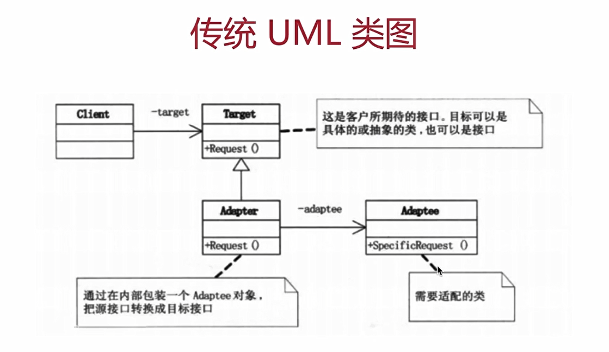
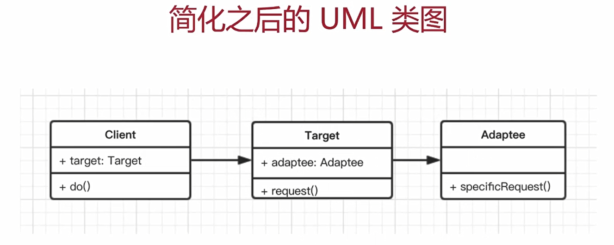

# 5. 适配器模式

---

## 5.1 介绍

- 旧接口格式和使用者不兼容
- 中间加一个适配转换接口

## 5.2 UML 类图




## 5.3 代码演示

```js
class Adaptee {
  specificRequest() {
    return '德国标准插头'
  }
}

class Target {
  constructor() {
    this.adaptee = new Adaptee()
  }
  request() {
    let info = this.adaptee.specificRequest()
    return `${info} - 转换器 - 中国标准插头`
  }
}

//  测试
let target = new Target()
let res = target.request()
console.log(res)
```

> **设计原则验证**
> 将旧接口和使用者进行分离
> 符合开放封闭原则
