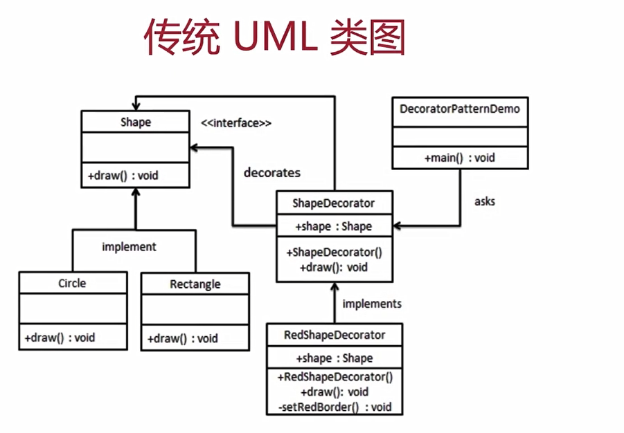

# 6.装饰器模式

---

## 6.1 介绍

- 为对象添加新功能
- 不改变其原有的功能和结构

## 6.2 UML 类图




## 6.3 代码实现

```js
class Circle {
  draw() {
    console.log('画一个圆形')
  }
}
class Decorator {
  constructor(circle) {
    this.circle = circle
  }
  draw() {
    this.circle.draw()
    this.setRedBorder(circle)
  }
  setRedBorder(circle) {
    console.log('设置红色边框')
  }
}
// 测试代码
let circle = new Circle()
circle.draw() // 画一个圆形

let dec = new Decorator(circle)
dec.draw() // 画一个圆形 设置红色边框
```

## 6.4 场景

### 6.4.1 ES7 装饰器

需要通过 babel 编译
npm 安装 `babel-plugin-transform-decorators-legacy`包

.babelrc

```js
    "plugins": ["transform-decorators-legacy"]
```

示例代码

```js
@testDec
class Demo {
  // ...
}

function testDec(target) {
  target.isDec = true
}

console.log(Demo.isDec) // true
```

装饰器原理

```js
@testDec
class Demo {}

//等同于
class Demo {}
Demo = testDec（Demo）|| Demo
```

### 6.4.2 core-decorators
