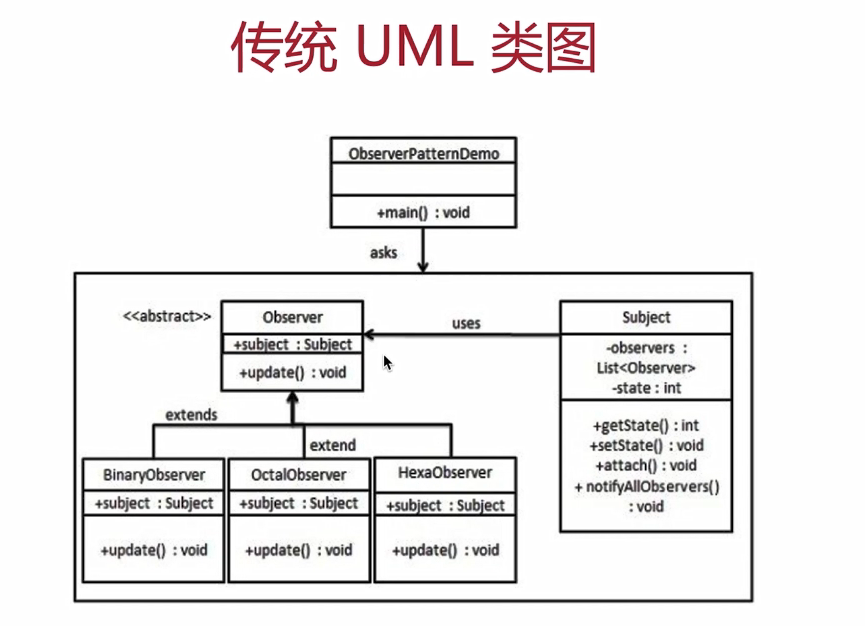
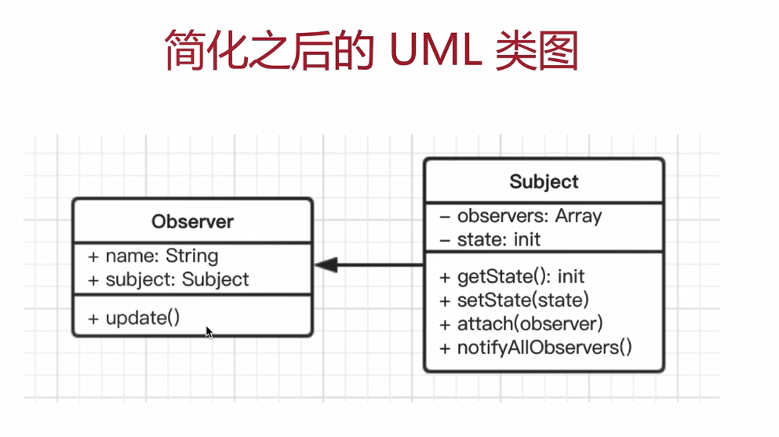

# 8. 观察者模式

---

## 8.1 介绍

- 发布 & 订阅
- 一对多

> 示例 点咖啡，点好之后坐等被叫

## 8.2 UML 类图





## 8.3 示例代码

```js
// 主题，保存状态，状态变化之后出发所有观察者对象
class Subject {
  constructor() {
    this.state = 0
    this.observers = []
  }
  getState() {
    return this.state
  }
  setState(state) {
    this.state = state
    this.notifyAllObservers()
  }
  notifyAllObservers() {
    this.observers.forEach((observer) => {
      observer.update()
    })
  }
  attach(observer) {
    this.observers.push(observer)
  }
}

// 观察者
class Observer {
  constructor(name, subject) {
    this.name = name
    this.subject = subject
    this.subject.attach(this)
  }
  update() {
    console.log(`${this.name} update,state:${this.subject.getState()}`)
  }
}

// 测试
let s = new Subject()
let o1 = new Observer('o1', s)
let o2 = new Observer('o2', s)
let o3 = new Observer('o3', s)
s.setState(1)
s.setState(2)
s.setState(3)
```

## 8.4 应用场景

## 8.4.1 网页绑定事件

```html
<button id="btn1">btn</button>

<script>
  $('#btn1').click(function () {
    console.log(1)
  })
  $('#btn1').click(function () {
    console.log(2)
  })
  $('#btn1').click(function () {
    console.log(3)
  })
</script>
```

## 8.4.2 Promise

## 8.4.3 jQuery Callbacks

[Callbacks 文档](https://www.runoob.com/jquery/misc-callbacks.html)

```js
var callbacks = $.Callbacks()

callbacks.add(function (info) {
  console.log('fn1', info)
})
callbacks.add(function (info) {
  console.log('fn2', info)
})
callbacks.add(function (info) {
  console.log('fn3', info)
})
callbacks.fire('gogogo')
callbacks.fire('fire')
```

## 8.4.4 nodejs 自定义事件

```js
const EventEmitter = require('events).EventEmitter
const emitter1 = new EventEmitter()
emitter1.on('some',(info)=>{
	// 监听 some 事件
	console.log('some event is occured 1',info)
})
emitter1.on('some',(info)=>{
	// 监听 some 事件
	console.log('some event is occured 2',info)
})
// 触发 some 事件
emitter1.emit('some','xxxx')
```

## 8.5 设计原则验证

- 主题和观察者分离，不是主动触发而是被动监听，两者解耦
- 符合开放封闭原则
