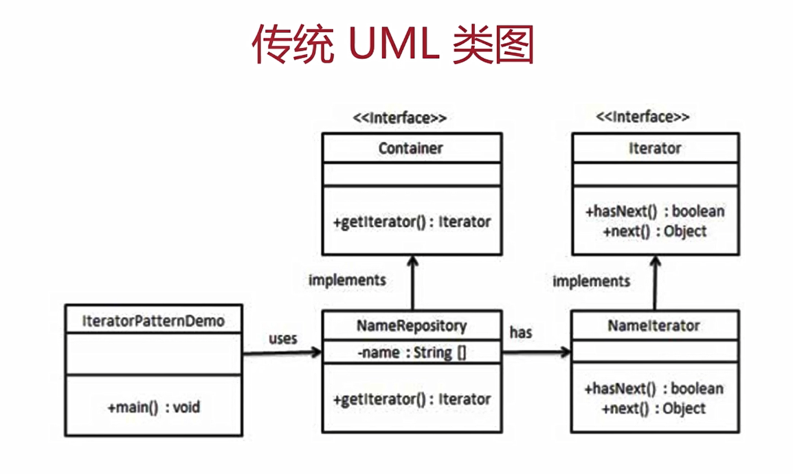
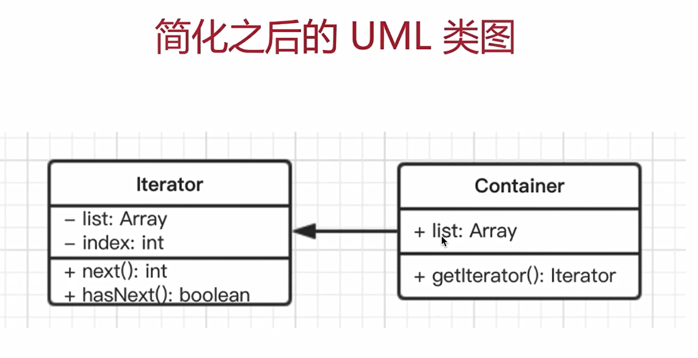

# 9. 迭代器模式

---

## 9.1 介绍

- 顺序访问一个集合
- 使用者无需知道集合的内部结构（封装）

## 9.2 UML 类图





## 9.3 代码演示

```js
// 遍历器的类
class Iterator {
  constructor(container) {
    this.list = container.list
    this.index = 0
  }
  next() {
    if (this.hasNext()) {
      return this.list[this.index++]
    }
    return null
  }
  hasNext() {
    return this.index < this.list.length
  }
}

class Container {
  constructor(list) {
    this.list = list
  }
  // 生成遍历器
  getIterator() {
    return new Iterator(this)
  }
}

// 测试代码
var arr = [1, 2, 3, 4, 5, 6]

let container = new Container(arr)
let iterator = container.getIterator()
while (iterator.hasNext()) {
  console.log(iterator.next())
}
```

## 9.4 使用场景

### 9.4.1 jQuery each

### 9.4.2 es6 Iterator

[Iterator 文档](https://es6.ruanyifeng.com/#docs/iterator)

es6 Iterator 为什么存在？

- ES6 语法中，有序集合的数据类型已经有很多
- `Array` `Map` `Set` `TypedArray` `arguments` `NodeList`
- 需要有一个统一的遍历接口来遍历所有数据类型
- 注意：object 不是有序集合，可以用 Map 代替

es6 Iterator 是什么？

- 以上数据类型，都有 `[Symbol.iterator]` 属性
- 属性值是函数，执行函数返回一个迭代器
- 这个迭代器就有 next 方法可以顺序迭代子元素
- 可运行 `Array.prototype[Symbol.iterator]` 来测试
