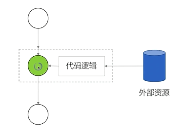

# 01  React出现的历史背景及特性介绍
---
## React很简单
react时钟整体刷新页面
- 1个新概念
- 4个必须API
- 单向数据流
- 完善的错误提示

## Flux架构 `单向数据流`

Flux 架构衍生的项目:`Redux`、`Mobx`

# 02  以组件方式考虑UI的构建
---
## 以组件方式考虑UI的构建
## 理解React组件
> props + state -->View
- React组件一般不提供方法，而是某种状态机
- React组件可以理解为一个纯函数
- 单向数据绑定

### 创建一个简单的组价

1. 创建静态UI
2. 考虑组件的状态组成
3. 考虑组件的交互方式

### 受控组价 vs 非受控组价
- 受控组价：表单元素状态由使用者维护
- 非受控组价：表单元素状态DOM自身维护

### 何时创建组件：单一职责原则
1. 每个组件只做一件事
2. 如果组件变得复杂，那么一个个拆分成小组件

### 数据状态管理：DRY原则
1. 能计算得到的状态就不要单独存储
2. 组件尽量无状态，所需数据通过props获取

# 03  JSX 的本质  不是模板引擎，而是语法糖
---
- JSX:在javascript代码中直接写HTML标记
- JSX的本质：动态创建组件的语法糖
- 在JSX中使用表达式
	1. JSX本身也是表达式
	2. 在属性中使用表达式
	3. 延展属性
	4. 表达式作为子元素
- JSX的优点
	1. 声明式创建界面的直观
	2. 代码动态创建界面的灵活
	3. 无需学习新的模版语言
- JSX约定：自定义组件以大写字母开头
	1. React认为小写的tag是原生DOM节点，如div
	2. 大写字母开头为自定义组件
	3. JSX标记可以直接使用属性语法，例如<menu.Item/>

# 04  React组件的生命周期及其使用场景
---
- Render阶段(纯净且没有副作用，可能会被React暂停、中止或重新启动)
- Pre-commit阶段（可以读取DOM）
- Commit阶段（可以使用DOM，运行副作用，安排更新）
---
- 创建时
- 更新时
- 卸载时
---
- constructor
	1. 用于初始化内部状态，很少使用
	2. 唯一可以直接修改`state`的地方
- getDerivedStateFromProps(react 16.3 新引入)
	1. 当`state`需要从`props`初始化时使用
	2. 尽量不要使用：维护两者状态一致性会增加复杂度
	3. 每次render都会调用
	4. 典型场景：表单控件获取默认值
- componentDidMount
	1. UI渲染完成后调用
	2. 只执行一次
	3. 典型场景：获取外部资源
- componentWillUnmount
	1. 组件移除时被调用
	2. 典型场景：资源释放
- getSnapshotBeforeUpdate
	1. 在页面`render`之前调用，`state`已更新
	2. 典型场景：获取`render`之前的`DOM`状态
- componentDidUpdate
	1. 每次UI更新是被调用
	2. 典型场景：页面需要根据`props`变化重新获取数据
- shouldComponentUpdate
	1. 决定`Vitual DOM`是否要重绘
	2. 一般可以由`PureComponent`自动实现
	3. 典型场景：性能优化
- render

# 05  理解Virtual DOM及key属性的作用
---
- JSX的运行基础：Virtual DOM

- 虚拟DOM的两个假设
	1. 组件的DOM结构是相对稳定的
	2. 类型相同的兄弟节点可以被唯一标识

 - 小结
	1. 算法复杂度为O(n)
	2. 虚拟DOM如何计算diff
	3. key属性的作用

# 06 组价复用的另外两种形式：高阶组件和函数作为自组件
---
- 高阶组件（HOC）
	1. 高阶组件接受组件作为参数，返回新的组件
	2. 
- 函数作为子组件
- 小结
	1. 高阶组件和函数子组件都是设计模式
	2. 可以实现更多场景的组件复用

# 07 Context API 的使用场景
---

# 08 使用脚手架工具创建React应用（Create React APP，Codesandbox，Rekit）

# 09 打包和部署
---
- 为什么需要打包？
	1. 编译ES6语法特性，编译JSX
	2. 整合资源，例如图片，LESS/SASS
	3. 优化代码体积
- 打包注意事项
	1. 设置nodejs环境为production
	2. 禁用开发时专用代码，如logger
	3. 设置应用根路径

