# 10 Redux（1）前端为何需要状态管理库
---
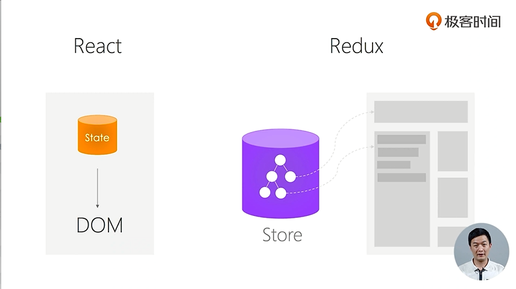

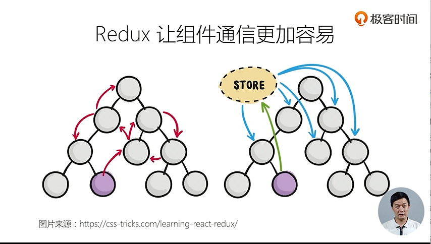

- Redux特性：Single source of Truth
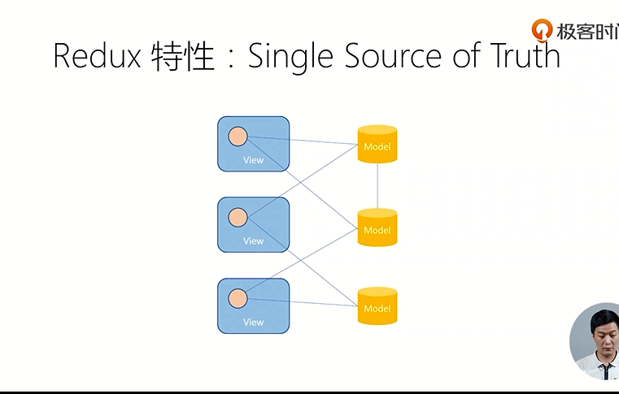
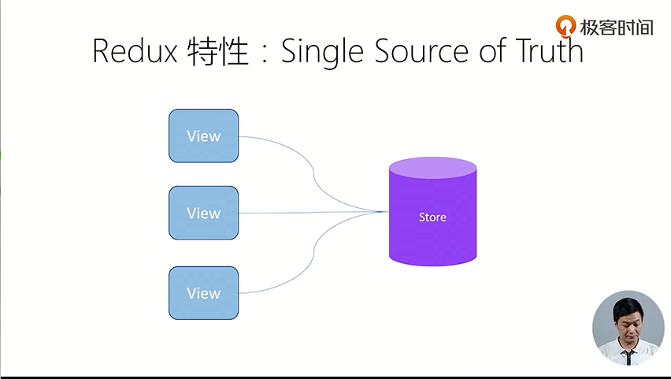

- Redux特性：可预测性
> state + action = new state

- Redux特性：纯函数更新Store

# 11  Redux(2)  深入理解 Store, Action, Reducer
---
- 理解Store
	1. getState()
	2. dispatch(action)
	3. subscribe(listener)
	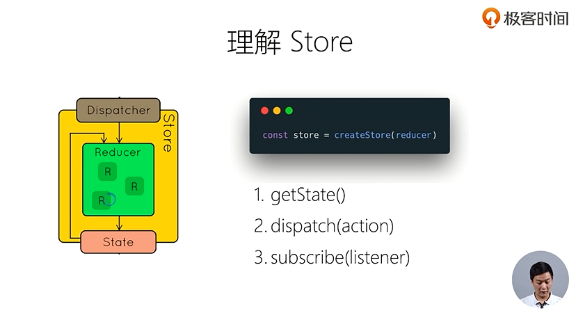
- 理解Action
	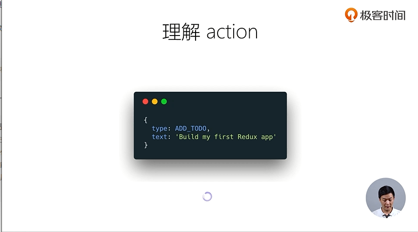
- 理解Reducer
	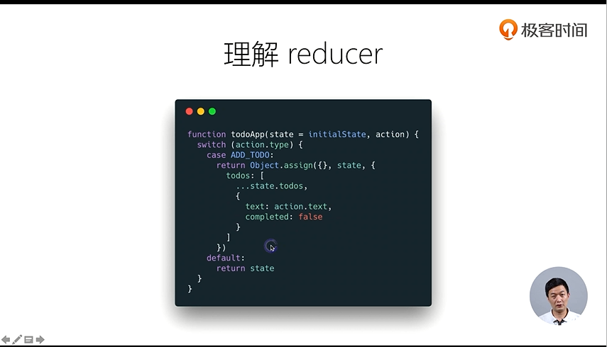
---

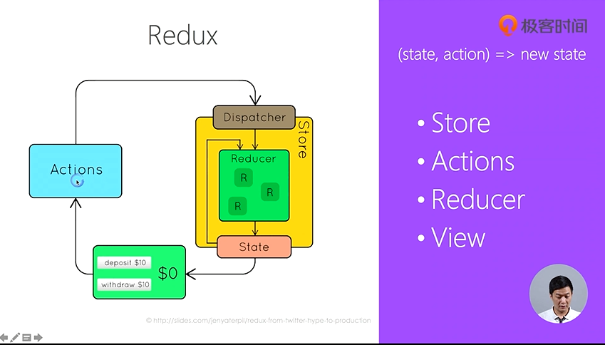	

- 理解combineReducers
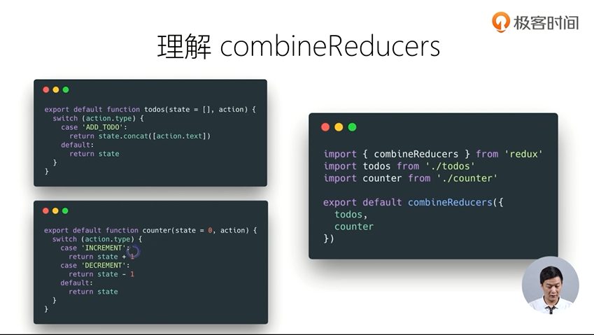
- 理解bindActionCreators
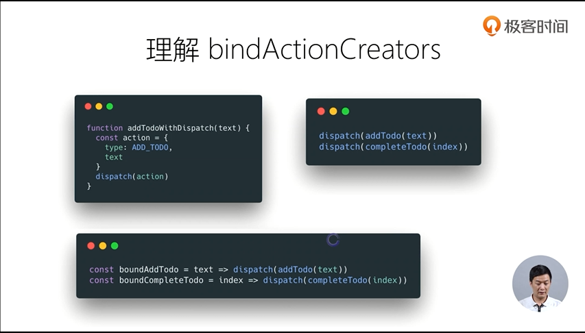	
	
# 12  Redux(3)  在React中使用Redux

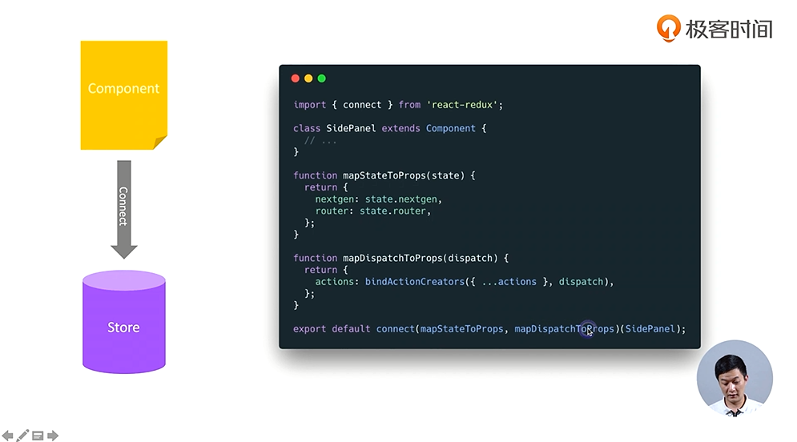	

- connect的工作原理：高阶组件
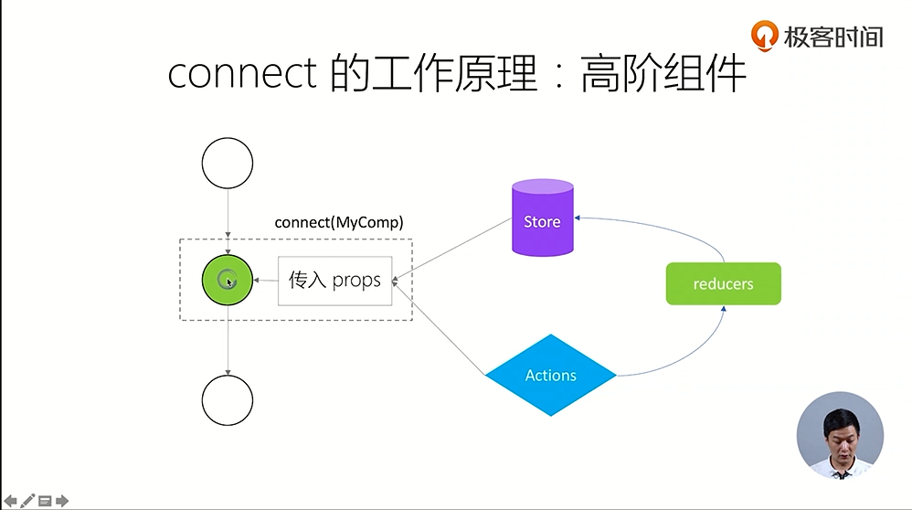	

# 13  Redux(4)  理解异步 Action，Redux 中间件

# 14  Redux(5)  如何组织Action和Reducer

# 15  Redux(6)  理解不可变数据（Immutability）

# 16  React Router（1）：路由不只是页面切换，更是代码组织方式

# 17  React Router（2）：参数定义，嵌套路由的使用场景

# 18  UI组件库对比和介绍：Ant.Design，Material UI，Semantic UI

# 19  使用Next.js创建React同构应用

# 20  使用Jest，Enzyme等工具进行单元测试

# 21  常用开发调试工具：ESLint，Prettier，React DevTool，Redux DevTool

