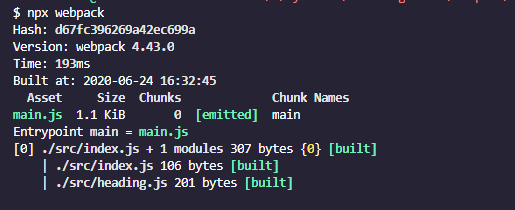

# 2.如何使用 Webpack 实现模块化打包

## Webpack 快速上手

通过一个案例，快速了解 Webpack 的基本使用，具体操作如下：

```js
└─ 2
├── src
│ ├── heading.js
│ └── index.js
└── index.html
```

```js
// ./src/heading.js
export default () => {
  const element = document.createElement('h2')
  element.textContent = 'Hello webpack'
  element.addEventListener('click', () => alert('Hello webpack'))
  return element
}
```

```js
// ./src/index.js
import createHeading from './heading.js'
const heading = createHeading()
document.body.append(heading)
```

```html
<!DOCTYPE html>
<html lang="en">
  <head>
    <meta charset="UTF-8" />
    <title>Webpack - 快速上手</title>
  </head>
  <body>
    <script type="module" src="src/index.js"></script>
  </body>
</html>
```

> P.S. type="module" 这种用法是 ES Modules 中提出的标准，用来区分加载的是一个普通 JS 脚本还是一个模块。

在上面的案例中，按照 ES Modules 的标准，这里的 index.html 可以直接在浏览器中正常工作，但是对于不支持 ES Moudles 标准的浏览器，直接使用就会出现错误，所以需要使用 Webpack 这样的工具，将这里按照模块化方式拆分的 JS 代码再次打包到一起。

---

接下来尝试引入 Webpack 去处理上述案例中的 JS 模块打包。由于 Webpack 是一个 npm 工具模块，所以需先初始化一个 package.json 文件，用来管理 npm 依赖版本，完成之后，再来安装 Webpack 的核心模块以及它的 cli 模块，具体操作如下：

```vb
$ npm init --yes
$ npm i webpack webpack-cli --save-dev
```

> P.S. webpack 是 Webpack 的核心模块，webpack-cli 是 Webpack 的 CLI 程序，用来在命令行中调用 Webpack。

安装完成之后，webpack-cli 所提供的 CLI 程序就会出现在 node_modules/.bin 目录当中，我们可以通过 npx 快速找到 CLI 并运行它，具体操作如下：

```vb
$ npx webpack --version
v4.43.8
```

> P.S. npx 是 npm 5.2 以后新增的一个命令，可以用来更方便的执行远程模块或者项目 node_modules 中的 CLI 程序。

这里我们使用的 Webpack 版本是 v4.42.1，有了 Webpack 后，就可以直接运行 webpack 命令来打包 JS 模块代码，具体操作如下：

```vb
$ npx webpack
```

这个命令在执行的过程中，Webpack 会自动从 src/index.js 文件开始打包，然后根据代码中的模块导入操作，自动将所有用到的模块代码打包到一起。

完成之后，控制台会提示：顺着 index.js 有两个 JS 文件被打包到了一起。与之对应的就是项目的根目录下多出了一个 dist 目录，我们的打包结果就存放在这个目录下的 main.js 文件中，具体操作如下图所示：



这里我们回到 `index.html` 中修改引入文件的路径，由于打包后的代码就不会再有 `import` 和 `export` 了，所以我们可以删除`type="module"`。再次回到浏览器中，查看这个页面，这时我们的代码仍然可以正常工作，`index.html` 的代码如下所示：

```html
<!DOCTYPE html>
<html lang="en">
  <head>
    <meta charset="UTF-8" />
    <title>Webpack - 快速上手</title>
  </head>
  <body>
    <script src="dist/main.js"></script>
  </body>
</html>
```

我们也可以将 Webpack 命令定义到 npm scripts 中，这样每次用起来会更加方便，具体如下：

```json
{
  "name": "2",
  "version": "1.0.0",
  "description": "",
  "main": "index.js",
  "scripts": {
    "build": "webpack"
  },
  "keywords": [],
  "author": "",
  "license": "ISC",
  "devDependencies": {
    "webpack": "^4.43.0",
    "webpack-cli": "^3.3.12"
  }
}
```

对于 Webpack 里最基本的使用，总结下来就是：先安装 webpack 相关的 npm 包，然后使用 webpack-cli 所提供的命令行工具进行打包。

## 配置 Webpack 的打包过程

Webpack 4 以后的版本支持零配置的方式直接启动打包，整个过程会按照约定将`src/index.js`作为打包入口，最终打包的结果会存放到`dist/main.js`中。

但很多时候，我们需要自定义这些路径约定，例如，在下面这个案例中，我需要它的打包入口是`src/main.js`，那此时我们通过配置文件的方式修改 Webpack 的默认配置，在项目的根目录下添加一个`webpack.config.js`，具体结构如下：

```js
 └─ 2
    ├── src
    │ ├── heading.js
    │ └── main.js
    ├── index.html
    ├── package.json
+   └── webpack.config.js ···················· Webpack 配置文件
```

`webpack.config.js` 是一个运行在 Node.js 环境中的 JS 文件，也就是说我们需要按照 `CommonJS` 的方式编写代码，这个文件可以导出一个对象，我们可以通过所导出对象的属性完成相应的配置选项。

这里先尝试添加一个 `entry` 属性，这个属性的作用就是指定 Webpack 打包的入口文件路径。我们将其设置为 `src/main.js`，具体代码如下所示：

```js
// ./webpack.config.js
module.exports = {
  entry: './src/main.js'
}
```

配置完成后，回到命令行终端重新运行打包命令，此时 Webpack 就会从 src/main.js 文件开始打包。

除了 entry 的配置以外，我们还可以通过 output 属性设置输出文件的位置。output 属性的值必须是一个对象，通过这个对象的 filename 指定输出文件的文件名称，path 指定输出的目录，具体代码如下所示：

```js
// ./webpack.config.js
const path = require('path')

module.exports = {
  entry: './src/main.js',
  output: {
    filename: 'bundle.js',
    path: path.join(__dirname, 'output')
  }
}
```

> TIPS；webpack.config.js 是运行在 Node.js 环境中的代码，所以直接可以使用 path 之类的 Node.js 内置模块。

由于 Webpack 支持的配置有很多，详细的文档可在 Webpack 官网找到[https://webpack.js.org/configuration/#options](https://webpack.js.org/configuration/#options)

## 让配置文件支持智能提示

```js
// ./webpack.config.js
import { Configuration } from 'webpack'

/**
 * @type {Configuration}
 */
const config = {
  entry: './src/index.js',
  output: {
    filename: 'bundle.js'
  }
}

module.exports = config
```

> 需要注意的是：我们添加的 import 语句只是为了导入 Webpack 配置对象的类型，这样做的目的是为了标注 config 对象的类型，从而实现智能提示。在配置完成后一定要记得注释掉这段辅助代码，因为在 Node.js 环境中默认还不支持 import 语句，如果执行这段代码会出现错误。

```js
// 一定记得运行 Webpack 前先注释掉这里。
// import { Configuration } from 'webpack'
```

智能提示的效果，如下所示：


## Webpack 工作模式

Webpack 4 新增了一个工作模式的用法，这种用法大大简化了 Webpack 配置的复杂程度。你可以把它理解为针对不同环境的几组预设配置：

- `production` 模式下，启动内置优化插件，自动优化打包结果，打包速度偏慢；
- `development` 模式下，自动优化打包速度，添加一些调试过程中的辅助插件；
- `none` 模式下，运行最原始的打包，不做任何额外处理。

针对工作模式的选项，如果你没有配置一个明确的值，打包过程中命令行终端会打印一个对应的配置警告。在这种情况下 Webpack 将默认使用 production 模式去工作。

production 模式下 Webpack 内部会自动启动一些优化插件，例如，自动压缩打包后的代码。这对实际生产环境是非常友好的，但是打包的结果就无法阅读了。

修改 Webpack 工作模式的方式有两种：

- 通过 CLI --mode 参数传入；
- 通过配置文件设置 mode 属性。

上述三种 Webpack 工作模式的详细差可以在官方文档中查看：[https://webpack.js.org/configuration/mode/](https://webpack.js.org/configuration/mode/)
