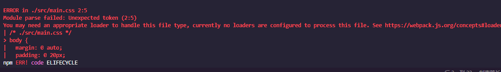
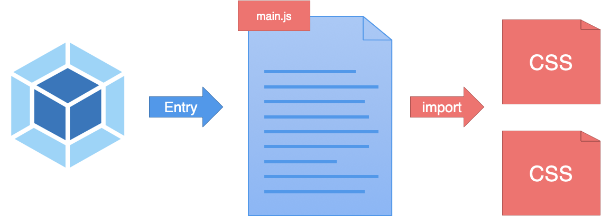

# 3.如何通过 Loader 实现特殊资源加载？

如何通过 Loader 机制实现特殊资源加载，通过开发一个 Loader 深入理解 Webpack Loader 机制的原理。

## 如何加载资源模块

首先，我们尝试通过 Webpack 打包项目中的一个 CSS 文件，由此开始探索 Webpack 是如何加载资源模块的？

在下面这个案例中，我们在项目的 src 目录下添加一个普通的样式文件 main.css，具体结构和样式代码如下所示：

```js
 └─ 03-webpack-loader ························ sample root dir
    ├── src ·································· source dir
+   │   └── main.css ························· main styles
    ├── package.json ························· package file
    └── webpack.config.js ···················· webpack config file
```

```css
/* ./src/main.css */
body {
  margin: 0 auto;
  padding: 0 20px;
  max-width: 800px;
  background: #f4f8fb;
}
```

然后将 Webpack 配置中的入口文件路径指定为 main.css 的文件路径，让 Webpack 直接打包 CSS 资源文件，具体配置如下所示：

```js
module.exports = {
  // 样式文件路径
  entry: './src/main.css',
  output: {
    filename: 'bundle.js'
  }
}
```

配置完成过后回到命令行终端再次运行 Webpack 打包命令，此时你会发现命令行报出了一个模块解析错误，如下所示：



出现这个错误的原因是因为 Webpack 内部默认只能够处理 JS 模块代码，也就是说在打包过程中，它默认把所有遇到的文件都当作 JavaScript 代码进行解析，但是此处我们让 Webpack 处理的是 CSS 代码，而 CSS 代码是不符合 JavaScript 语法的，所以自然会报出模块解析错误。

Webpack 是用 Loader（加载器）来处理每个模块的，而内部默认的 Loader 只能处理 JS 模块，如果需要加载其他类型的模块就需要配置不同的 Loader。这也就引出了我们今天的主角：`Loader`。


## 加载器的使用方式

需要的是一个可以加载 CSS 模块的 Loader，最常用到的是 css-loader。我们需要通过 npm 先去安装这个 Loader，然后在配置文件中添加对应的配置，具体操作和配置如下所示：

```vb
$ npm install css-loader --save-dev
# or yarn add css-loader --dev
```

```js
// ./src/webpack.config.js
module.exports = {
  entry: './src/main.css',
  output: {
    filename: 'bundle.js'
  },
  module: {
    rules: [
      {
        test: /\.css$/, // 根据打包过程中所遇到文件路径匹配是否使用这个 loader
        use: 'css-loader' // 指定具体的 loader
      }
    ]
  }
}
```

在配置对象的 module 属性中添加一个 rules 数组。这个数组就是我们针对资源模块的加载规则配置，其中的每个规则对象都需要设置两个属性：

- 首先是 test 属性，它是一个正则表达式，用来匹配打包过程中所遇到文件路径，这里我们是以 .css 结尾；
- 然后是 use 属性，它用来指定匹配到的文件需要使用的 loader，这里用到的是 css-loader。

配置完成过后，我们回到命令行终端重新运行打包命令，打包过程就不会再出现错误了，因为这时 CSS 文件会交给 css-loader 处理过后再由 Webpack 打包。


## 样式模块加载的问题

此时，如果你尝试在页面中使用这里输出的 bundle.js 文件，你会发现刚刚的这个 main.css 模块并没有工作。

**css-loader 只会把 CSS 模块加载到 JS 代码中，而并不会使用这个模块。**

所以这里我们还需要在 css-loader 的基础上再使用一个 style-loader，把 css-loader 转换后的结果通过 style 标签追加到页面上。

```js
// ./src/webpack.config.js
module.exports = {
  entry: './src/main.css',
  output: {
    filename: 'bundle.js'
  },
  module: {
    rules: [
      {
        test: /\.css$/,
        // 这里需要注意的是，一旦配置多个 Loader，执行顺序是从后往前执行的，所以这里一定要将 css-loader 放在最后，因为必须要 css-loader 先把 CSS 代码转换为 JS 模块，才可以正常打包
        use: ['style-loader', 'css-loader']
      }
    ]
  }
}
```

**`style-loader` 的作用总结一句话就是，将 `css-loader` 中所加载到的所有样式模块，通过创建 style 标签的方式添加到页面上。**

以上就是我们对 Loader 使用的一些探索，Loader 是 Webpack 实现整个前端模块化的核心。因为只有通过不同的 Loader，Webpack 才可以实现任何类型资源的加载。

## 通过 JS 加载资源模块

正如刚刚所提到的，一般 Webpack 打包的入口还是 JavaScript。因为从某种程度上来说，打包入口就是应用的运行入口，而目前前端应用中的业务是由 JS 驱动的，所以更合理的做法还是把 JS 文件作为打包的入口，然后在 JS 代码中通过 import 语句去加载 CSS 文件。

```js
 └─ 03-webpack-loader ······················· sample root dir
    ├── src ································· source dir
    │   ├── style.css ······················· style module
+   │   └── main.js ························· entry module
    ├── package.json ························ package file
    └── webpack.config.js ··················· webpack config file
```

```js
// ./src/main.js
import './style.css'

// app logic...
console.log('App starts running~')
```



即便是通过 JS 代码去加载的 CSS 模块，css-loader 和 style-loader 仍然可以正常工作。因为 Webpack 在打包过程中会循环遍历每个模块，然后根据配置将每个遇到的模块交给对应的 Loader 去处理，最后再将处理完的结果打包到一起。

**常用的 loader**

| 名称           | 链接                                                                                                 |
| -------------- | ---------------------------------------------------------------------------------------------------- |
| file-loader    | [https://webpack.js.org/loaders/file-loader](https://webpack.js.org/loaders/file-loader)             |
| url-loader     | [https://webpack.js.org/loaders/url-loader](https://webpack.js.org/loaders/url-loader)               |
| babel-loader   | [https://webpack.js.org/loaders/babel-loader](https://webpack.js.org/loaders/babel-loader)           |
| style-loader   | [https://webpack.js.org/loaders/style-loader](https://webpack.js.org/loaders/style-loader)           |
| css-loader     | [https://webpack.js.org/loaders/css-loader](https://webpack.js.org/loaders/css-loader)               |
| sass-loader    | [https://webpack.js.org/loaders/sass-loader](https://webpack.js.org/loaders/sass-loader)             |
| postcss-loader | [https://webpack.js.org/loaders/postcss-loader](https://webpack.js.org/loaders/postcss-loader)       |
| eslint-loader  | [https://github.com/webpack-contrib/eslint-loader](https://github.com/webpack-contrib/eslint-loader) |
| vue-loader     | [https://github.com/vuejs/vue-loader](https://github.com/vuejs/vue-loader)                           |

## 开发一个 Loader

Loader 作为 Webpack 的核心机制，内部的工作原理却非常简单。接下来开发一个自己的 Loader，通过这个开发过程再来深入了解 Loader 的工作原理。

开发一个可以加载 markdown 文件的加载器，以便可以在代码中直接导入 md 文件。我们都应该知道 markdown 一般是需要转换为 html 之后再呈现到页面上的，所以我希望导入 md 文件后，直接得到 markdown 转换后的 html 字符串，如下图所示：


新建一个`markdown-loader.js`文件

```js
 └─ 03-webpack-loader ······················· sample root dir
    ├── src ································· source dir
    │   ├── about.md ························ markdown module
    │   └── main.js ························· entry module
    ├── package.json ························ package file
+   ├── markdown-loader.js ·················· markdown loader
    └── webpack.config.js ··················· webpack config file
```

```markdown
<!-- ./src/about.md -->

# About

this is a markdown file.
```

```js
// ./src/main.js
import about from './about.md'

console.log(about)
// 希望 about => '<h1>About</h1><p>this is a markdown file.</p>'
```

每个 Webpack 的 Loader 都需要导出一个函数，这个函数就是我们这个 Loader 对资源的处理过程，它的输入就是加载到的资源文件内容，输出就是我们加工后的结果。我们通过 source 参数接收输入，通过返回值输出。这里我们先尝试打印一下 source，然后在函数的内部直接返回一个字符串 hello loader ~，具体代码如下所示：

```js
// ./markdown-loader.js
module.exports = (source) => {
  // 加载到的模块内容 => '# About\n\nthis is a markdown file.'
  console.log(source)
  // 返回值就是最终被打包的内容
  return 'hello loader ~'
}
```

完成以后，我们回到 Webpack 配置文件中添加一个加载器规则，这里匹配到的扩展名是 `.md`，使用的加载器就是我们刚刚编写的这个 `markdown-loader.js` 模块，具体代码如下所示：

```js
// ./webpack.config.js
module.exports = {
  entry: './src/main.js',
  output: {
    filename: 'bundle.js'
  },
  module: {
    rules: [
      {
        test: /\.md$/,
        // 直接使用相对路径
        use: './markdown-loader'
      }
    ]
  }
}
```

配置完成后，我们再次打开命令行终端运行打包命令，如下图所示：


打包过程中命令行确实打印出来了我们所导入的 Markdown 文件内容，这就意味着 Loader 函数的参数确实是文件的内容。

但同时也报出了一个解析错误，说的是：`You may need an additional loader to handle the result of these loaders.`（我们可能还需要一个额外的加载器来处理当前加载器的结果）。

那这究竟是为什么呢？其实 Webpack 加载资源文件的过程类似于一个工作管道，你可以在这个过程中依次使用多个 Loader，但是最终这个管道结束过后的结果必须是一段标准的 JS 代码字符串。


所以我们这里才会出现上面提到的错误提示，那解决的办法也就很明显了：

- **直接在这个 Loader 的最后返回一段 JS 代码字符串；**
- **再找一个合适的加载器，在后面接着处理我们这里得到的结果。**

先来尝试第一种办法。回到 markdown-loader 中，我们将返回的字符串内容修改为 console.log('hello loader~')，然后再次运行打包，此时 Webpack 就不再会报错了，代码如下所示：

```js
// ./markdown-loader.js
module.exports = (source) => {
  // 加载到的模块内容 => '# About\n\nthis is a markdown file.'
  console.log(source)
  // 返回值就是最终被打包的内容
  // return 'hello loader ~'
  return 'console.log("hello loader ~")'
}
```

## 实现 Loader 的逻辑

了解了 Loader 大致的工作机制过后，我们再回到 markdown-loader.js 中，接着完成我的需求。这里需要安装一个能够将 Markdown 解析为 HTML 的模块，叫作 marked。

安装完成后，我们在 markdown-loader.js 中导入这个模块，然后使用这个模块去解析我们的 source。这里解析完的结果就是一段 HTML 字符串，如果我们直接返回的话同样会面临 Webpack 无法解析模块的问题，正确的做法是把这段 HTML 字符串拼接为一段 JS 代码。

此时我们希望返回的代码是通过 module.exports 导出这段 HTML 字符串，这样外界导入模块时就可以接收到这个 HTML 字符串了。如果只是简单地拼接，那 HTML 中的换行和引号就都可能会造成语法错误，所以我这里使用了一个小技巧，具体操作如下所示：

```js
// ./markdown-loader.js
const marked = require('marked')

module.exports = (source) => {
  // 1. 将 markdown 转换为 html 字符串
  const html = marked(source)
  // html => '<h1>About</h1><p>this is a markdown file.</p>'
  // 2. 将 html 字符串拼接为一段导出字符串的 JS 代码
  const code = `module.exports = ${JSON.stringify(html)}`
  return code
  // code => 'export default "<h1>About</h1><p>this is a markdown file.</p>"'
}
```

除了 module.exports 这种方式，Webpack 还允许我们在返回的代码中使用 ES Modules 的方式导出，例如，我们这里将 module.exports 修改为 export default，然后运行打包，结果同样是可以的，Webpack 内部会自动转换 ES Modules 代码。

```js
// ./markdown-loader.js
const marked = require('marked')

module.exports = (source) => {
  const html = marked(source)
  // const code = `module.exports = ${JSON.stringify(html)}`
  const code = `export default ${JSON.stringify(html)}`
  return code
}
```

## 多个 Loader 的配合

我们还可以尝试一下刚刚说的第二种思路，就是在我们这个 markdown-loader 中直接返回 HTML 字符串，然后交给下一个 Loader 处理。这就涉及多个 Loader 相互配合工作的情况了。

我们回到代码中，这里我们直接返回 marked 解析后的 HTML，代码如下所示：

```js
// ./markdown-loader.js
const marked = require('marked')

module.exports = (source) => {
  // 1. 将 markdown 转换为 html 字符串
  const html = marked(source)
  return html
}
```

然后我们再安装一个处理 HTML 的 Loader，叫作 html-loader，代码如下所示：

```js
// ./webpack.config.js
module.exports = {
  entry: './src/main.js',
  output: {
    filename: 'bundle.js'
  },
  module: {
    rules: [
      {
        test: /\.md$/,
        use: ['html-loader', './markdown-loader']
      }
    ]
  }
}
```

**总体来说，Loader 机制是 Webpack 最核心的机制，因为正是有了 Loader 机制，Webpack 才能足以支撑整个前端项目模块化的大梁，实现通过 Webpack 去加载任何你想要加载的资源。**
