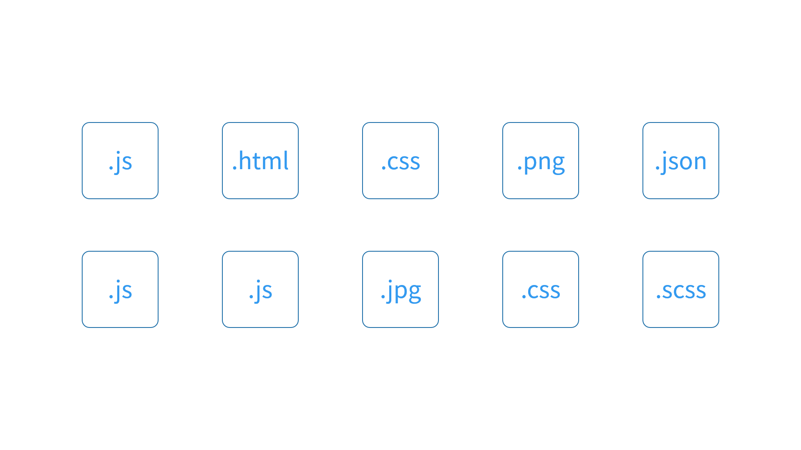

# 5.探索 Webpack 运行机制与核心工作原理

工作过程简介
其实 Webpack 官网首屏的英雄区就已经很清楚地描述了它的工作原理，如下图所示：

那这里我们先来快速理解一下 Webpack 打包的核心工作过程。我们以一个普通的前端项目为例，项目中一般都会散落着各种各样的代码及资源文件，如下图所示：

比如 JS、CSS、图片、字体等，这些文件在 Webpack 的思想中都属于当前项目中的一个模块。Webpack 可以通过打包，将它们最终聚集到一起。Webpack 在整个打包的过程中：

- 通过 Loader 处理特殊类型资源的加载，例如加载样式、图片；
- 通过 Plugin 实现各种自动化的构建任务，例如自动压缩、自动发布。

具体来看打包的过程，Webpack 启动后，会根据我们的配置，找到项目中的某个指定文件（一般这个文件都会是一个 JS 文件）作为入口。然后顺着入口文件中的代码，根据代码中出现的 import（ES Modules）或者是 require（CommonJS）之类的语句，解析推断出来这个文件所依赖的资源模块，然后再分别去解析每个资源模块的依赖，周而复始，最后形成整个项目中所有用到的文件之间的依赖关系树，下面这个动画生动的演示了这个过程：

有了这个依赖关系树过后， Webpack 会遍历（递归）这个依赖树，找到每个节点对应的资源文件，然后根据配置选项中的 Loader 配置，交给对应的 Loader 去加载这个模块，最后将加载的结果放入 bundle.js（打包结果）中，从而实现整个项目的打包，具体操作可以参考下面的动画：

