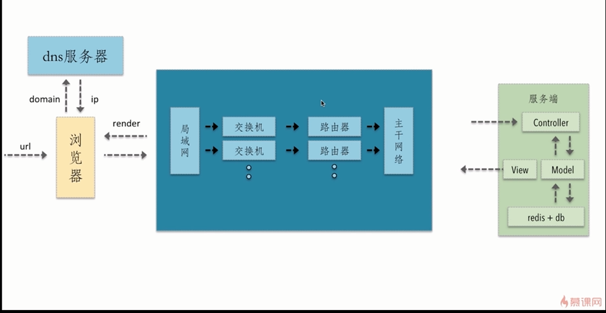
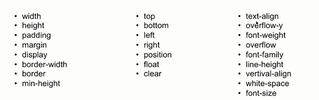
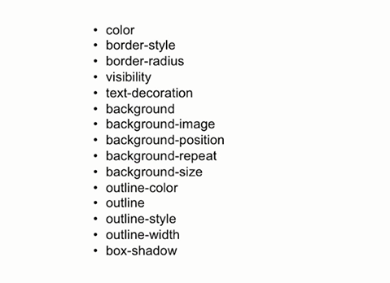
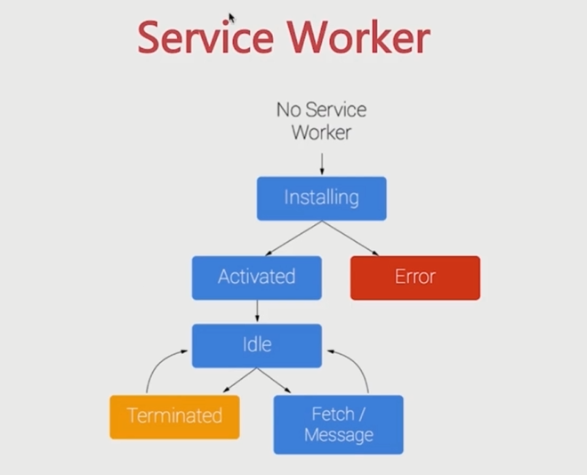
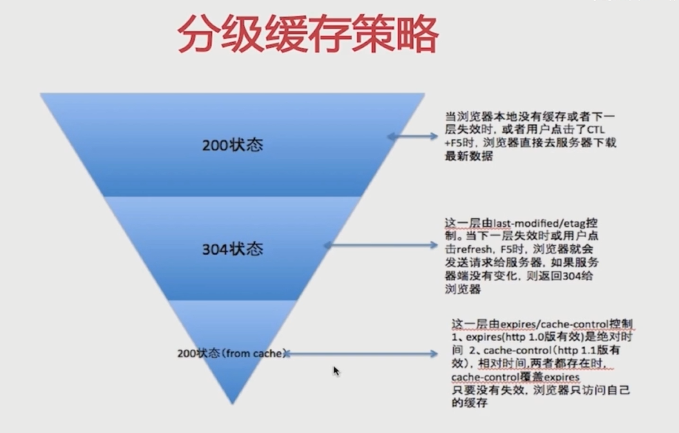
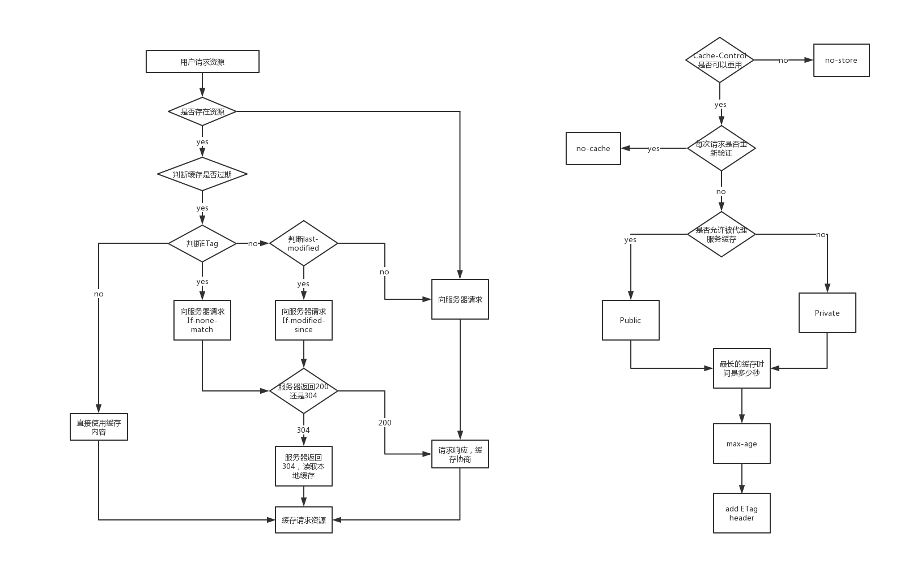
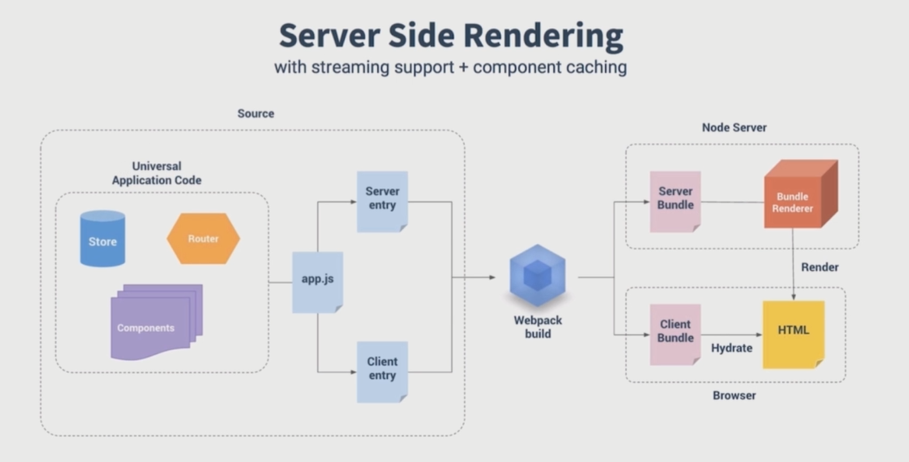

# 1. 资源的合并与压缩

### 1.1 http 清求的过程及潜在的性能优化点

请求过程中一-些潜在的性能优化点

-   dns 是否可以通过缓存减少 dns 查询时间?
-   网络请求的过程走最近的网络环境?
-   相同的静态资源是否可以缓存?
-   能否减少请求 http 请求大小?
-   减少 http 请求
-   服务端渲染

> 深入理解 http 请求的过程是前端性能优化的核心

---

-   减少 http 请求数量
-   减少请求资源的大小

---

### 1.2 html 压缩

> HTML 代码压缩就是压缩这些在文本文件中有意义,但是在 HTML 中`不显示`的字符,包括`空格`,`制表符`,`换行符`等,还有一-些其他意义的字符,如 `HTML 注释`也可以被压缩。

> 如何进行 html 压缩:

1. 使用在线网站进行压缩
2. nodejs 提供了 `html-minifier` 工具
3. 后端模板引擎渲染压缩

### 1.3 css 压缩

◆ 无效代码删除
◆ css 语义合并

> 如何进行 css 压缩:

1. 使用在线网站进行压缩
2. 使用 html-minifier 对 html 中的 css 进行压缩
3. 使用 clean-css 对 CSS 进行压缩

### 1.4 js 的压缩和混乱

◆ 无效字符的删除
◆ 剔除注释
◆ 代码语义的缩减和优化
◆ 代码保护

> 如何进行 js 压缩和混乱:

1. 使用在线网站进行压缩
2. 使用 html-minifier 对 html 中的 js 进行压缩
3. 使用 uglifyjs2 对 js 进行压缩

### 1.5 文件合并

> 文件合并存在的问题:

● 首屏渲染问题
● 缓存失效问题

> 对于存在的问题，有以下建议

● 公共库合并
● 不同页面的合并
● 见机行事,随机应变

> 如何进行文件合并:

1. 使用在线网站进行文件合并
2. 使用 nodejs(`webpack`、`gulp`) 实现文件合并

### 1.6 开启 gzip

#### 小结

◆ web 前端的核心概念和 web 前端性能优化的意义所在
◆ http 请求的过程及其中潜在的性能优化点
◆ 压缩与合并的基本理念和使用
◆ 在实战中体会和掌握本节课的内容在业务中的真实使用

---

# 2. 图片相关的优化

### 2.1 JPG 图片的解析过程

### 2.2 png8/png24/png32 之间的区别

-   `png8` 一 256 色 + 支持透明
-   `png24`-- 2^24 色 + ~~`不支持透明?`~~
-   `png32` 一 2^24 色 + 支持透明

本质是`文件大小、色彩丰富度`不同

> 每种图片格式都有自己的特点,针对不同的业务场景选择不同的图片格式很重要

### 2.3 不同格式图片常用的业务场景

> 不同格式图片的特点

-   jpg 有损压缩,压缩率高,不支持透明
-   png 支持透明,浏览器兼容好
-   webp 压缩程度更好,在 ios webview 有兼容性问题
-   svg 矢量图 ,代码内嵌,相对较小,图片样式相对简单的场景

> 不同格式图片常用的业务场景

-   jpg 一 大部分不需要透明图片的业务场景
-   png 一 大部分需 要透明图片的业务场景
-   webp 一 安卓全部
-   svg 矢量图 一 图片样式相对简单的业务场景

### 2.4 图片压缩的几种方法

-   css 雪碧图

    > 把你的网站上用到的一些图片整合到一张单独的图片中

    `优点`：减少你的网站的 HTTP 请求数量
    `缺点`：整合图片比较大时,一次加载比较慢

-   Image inline

    > 将图片的内容内嵌到 HTML 中（base64）

    `优点`：减少你的网站的 HTTP 请求数量

-   使用矢量图

    > 使用 svg 进行矢量图的绘制、使用 iconfont 解决 icon 问题

-   在安卓下使用 webp
    > WebP 的优势体现在它具有更优的图像数据压缩算法，能带来更小的图片体积,而且拥有肉眼识别无差异的图像质量;同时具备了无损和有损的压缩模式、Alpha 透明以及动画的特性,在 JPEG 和 PNG 上的转化效果都非常优秀、稳定和统一。

# 3. css 和 js 的装载和执行

### 3.1 HTML 页面加载渲染的过程

### 3.2 HTML 渲染过程的一些特点

-   顺序执行、并发加载
-   是否阻塞
-   依赖关系
-   引入方式

### 3.3 顺序执行、并发加载

-   词法分析
-   并发加载
-   并发上限

### 3.4 css 阻塞和 js 阻塞

> css 阻塞

-   css head 中阻塞页面的渲染
-   css 阻塞 js 的执行
-   css 不阻塞外部脚本的加载

> js 阻塞

-   直接引入的 js 阻塞页面的渲染
-   js 不阻塞资源的加载
-   js 是顺序执行，阻塞后续 js 逻辑的执行

# 4. 懒加载与预加载

### 4.1 懒加载原理

-   图片进入可视区域之后请求图片资源
-   对于电商等图片很多,页面很长的业务场景适用
-   减少无效资源的加载
-   并发加载的资源过多 会阻塞 js 的加载,影响网站的正常使用

> 当图片进入可视区域时，再去请求资源
>
> 需要监听 scroll 事件,在回调中判断图片是否进入可视区域

### 4.2 预加载原理

-   图片等静态资源在使用之前的提前请求
-   资源使用到时能从缓存中加载,提升用户体验
-   页面展示的依赖关系维护

# 5. 重绘与回流

浏览器重绘与回流的机制

### 5.1 css 性能会让 javascript 变慢？

-   一个线程 `=>` JavaScript 解析
-   一个线程 `=>` UI 渲染

> 两个线程是互斥的
>
> 频繁触发`重绘`与`回流`,会导致 UI 频繁渲染,最终导致 js 变慢

### 5.2 什么是重绘与回流

> 回流

-   当 render tree 中的一 部分(或全部)因为元素的`规模尺寸` ,`布局`，`隐藏`等改变而需要`重新构建`。这就称为回流(reflow)
-   当`页面布局`和`几何属性`改变时就需要回流

> 重绘

-   当 render tree 中的- -些元素需要更新属性,而这些属性只是影响元素的外观,风格,而不会影响布局的,比如 background-color。则就叫称为重绘。

> `回流必将弓|起重绘,而重绘不一定会引起回流`

### 5.3 避免重绘回流的两种方法

> 触发页面重布局的属性

-   盒子模型相关属性会触发重布局
-   定位属性及浮动也会触发重布局
-   改变节点内部文字结构也会触发重布局

> 避免重绘回流的两种方法

-   避免使用触发重绘、回流的 CSS 属性
-   将重绘、回流的影响范围限制在单独的图层之内

> 只触发重绘的属性

> 新建 DOM 的过程

1.  获取 DOM 后分割为多个图层
2.  对每个图层的节点计算样式结果( Recalculate style--样式重计算)
3.  为每个节点生成图形和位置( Layout--回流和重布局)
4.  将每个节点绘制填充到图层位图中( Paint Setup 和 Paint--重绘)
5.  图层作为纹理上传至 GPU
6.  符合多个图层到页面上生成最终屏幕图像( Composite Layers--图层重组)

将`频繁重绘回流`的 DOM 元素单独作为一个`独立图层`，那么这个 DOM 元素的重绘和回流的影响只会在这个图层中。

---

> 如何将 DOM 元素变成新的独立图层?

> Chrome 创建图层的条件

1. 3D 或透视变换 CSS 属性( `perspective transform` )
2. 使用加速视频解码的`<video>`节点
3. 拥有 3D ( `WebGL` )上下文或加速的 2D 上下文的`<canvas>`节点
4. 混合插件(如 `Flash` )
5. 对自己的 `opacity` 做 CSS 动画或使用一个动画 webkit 变换的元素
6. 拥有加速 CSS 过滤器的元素
7. 元素有一个包含复合层的后代节点(一个元素拥有一个子元素,该子元素在自己的层里)
8. 元素有一个 z-index 较低且包含-个复合层的兄弟元素(换句话说就是该元素在复合层上面渲染)

> 注：图层（layers）不能滥用

#### 实战优化点

1. 用 translate 替代 top 改变
2. 用 opacity 替代 visibility
3. 不要一条-条地修改 DOM 的样式,预先定义好 class ,然后修改 DOM 的 className
4. 把 DOM 离线后修改,比如:先把 DOM 给 display:none (有一次 Reflow) ,然后你修改 100 次,然后再把它显示出来
5. 不要把 DOM 结点的属性值放在一个循环里当成循环里的变量
6. 不要使用 table 布局,可能很小的一个小改动会造成整个 table 的重新布局
7. 动画实现的速度的选择
8. 对于动画新建图层
9. 启用 GPU 硬件加速

# 6. 浏览器存储

### 6.1 cookie

> 因为 HTTP 请求无状态，所以要 cookie 去维持客户端状态

> cookie 的生成方式：

-   http response header 中的 set-cookie
-   js 中可以通过 document.cookie 可以读写 cookie

> cookie 两个层面的作用

1. 用于浏览器端和服务端的交互
2. 客户端自身数据的存储

> cookie 的属性：

-   过期时间 `exprire`
-   `httponly`（不允许 js 读写）

> cookie 存储的限制

1. 作为浏览器存储，大小 4kb 左右
2. 需要设置过期时间 expire

> cookie 中在相关域名下面--cdn 的流量损耗
>
> 解决方法：cdn 的域名和主站的域名要分开

### 6.2 LocalStorage、SessionStorage

> LocalStorage

-   HTML 5 设计出来专 i 7 用于浏览器存储的
-   大小为 5M 左右
-   仅在客户端使用,不和服务端进行通信
-   接口封装较好
-   浏览器本地缓存方案

> SessionStorage

-   会话级别的浏览器存储
-   大小为 5M 左右
-   仅在客户端使用,不和服务端进行通信
-   接口封装较好
-   对于表单信息的维护

### 6.3 IndexedDB [MDN](https://developer.mozilla.org/zh-CN/docs/Web/API/IndexedDB_API)

-   IndexedDB 是一种低级 API, 用于客户端存储大量结构化数据。该 API 使用索引来实现对该数据的高性能搜索。虽然 Web Storage 对于存储较少量的数据很有用,但对于存储更大量的结构化数据来说,这种方法不太有用。IndexedDB 提供了一个解决方案。
-   为应用创建离线版本

### 6.4 PWA [MDN](https://developer.mozilla.org/zh-CN/docs/Web/Progressive_web_apps)

PWA (Progressive Web Apps)是一种 Web App 新模型并不是具体指某-种前沿的技术或者某一个单一 -的知识点,我们从英文缩写来看就能看出来,这是一个渐进式的 WebApp ,是通过一系列新的 Web 特性,配合优秀的 UI 交互设计,逐步的增强 Web App 的用户体验。

> PWA 的优点

-   可靠:在没有网络的环境中也能提供基本的页面访问,而不会出现"未连接到互联网”的页面。
-   快速:针对网页渲染及网络数据访问有较好优化。
-   融入( Engaging) : 应用可以被增加到手机桌面,并且和普通应用一样有全屏、推送等特性。

> 工具

-   `lighthouse` (谷歌浏览器插件)

### 6.5 Service Workers [MDN](https://developer.mozilla.org/zh-CN/docs/Web/API/Service_Worker_API)

Service Worker 是一个脚本,浏览器独立于当前网页,将其在后台运行,为实现一些不依赖页面或者用户交互的特性打开了一 扇大门。在未来这些特性将包括推送消息， 背景后台同步 geofencing (地理围栏定位) , 但它将推出的第一个首要特性,就是`拦截和处理网络请求的能力`,包括以编程方式来管理被缓存的响应。

> Service Workers 的应用

1. 使用拦截和处理网络请求的能力,去实现一个离线应用
2. 使用 Service Worker 在后台运行同时能和页面通信的能
   力,去实现大规模后台数据的处理

# 7. 缓存

## httpheader

### 7.1 Cache-Control [MDN](https://developer.mozilla.org/zh-CN/docs/Web/HTTP/Headers/Cache-Control)

-   max-age
-   s-maxage
-   private
-   public
-   no-cache
-   no-store

### 7.2 Expires

-   缓存过期时间,用来指定资源到期的时间,是服务器端的具体的时间点。
-   告诉浏览器在过期时间前浏览器可以直接从浏览器缓存取数据,而无需再次请求

### 7.3 Last-Modified/If-Modified-Since

-   基于客户端和服务端协商的缓存机制
-   last-modified --- response header
-   if-modified-since --- requestheader
-   需要与 cache-control 共同使用

> last-modified 缺点

1. 某些服务端不能获取精确的修改时间
2. 文件修改时间改了,但文件内容却没有变

### 7.5 Etag/If-None-Match

-   文件内容的 hash 值
-   etag ---- response header
-   if-none-match ---- request header
-   需要与 cache-control 共同使用

> 分级缓存策略

> 浏览器缓存机制

# 8. 服务端性能优化（eg：VUE）

下载 vue.js=>执行 vue.js 代码=>生成 html 页面

> 多层次的优化方案

-   构建层模板编译
-   数据无关的 prerender 的方式
-   服务端渲染

