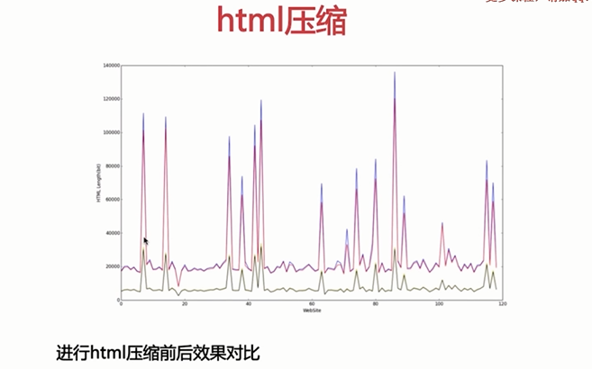
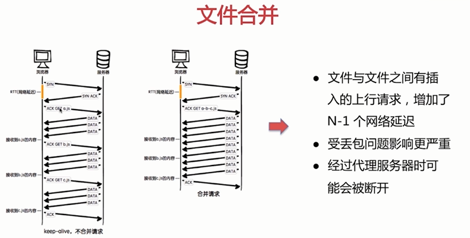
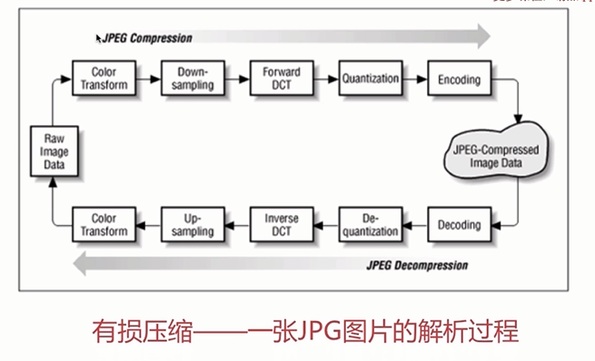
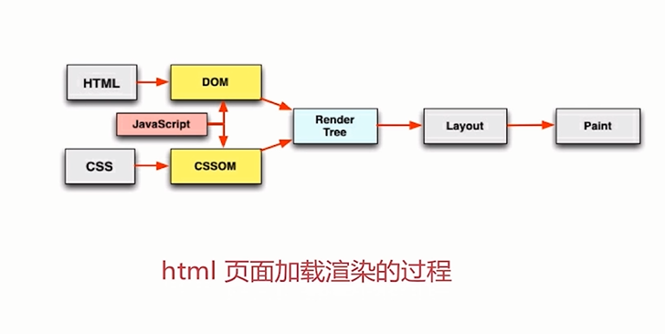

# 1. 资源的合并与压缩

# 1.1 http 清求的过程及潜在的性能优化点

请求过程中一-些潜在的性能优化点

-   dns 是否可以通过缓存减少 dns 查询时间?
-   网络请求的过程走最近的网络环境?
-   相同的静态资源是否可以缓存?
-   能否减少请求 http 请求大小?
-   减少 http 请求
-   服务端渲染

> 深入理解 http 请求的过程是前端性能优化的核心

---

-   减少 http 请求数量
-   减少请求资源的大小

---

### 1.2 html 压缩

> HTML 代码压缩就是压缩这些在文本文件中有意义,但是在 HTML 中`不显示`的字符,包括`空格`,`制表符`,`换行符`等,还有一-些其他意义的字符,如 `HTML 注释`也可以被压缩。

> 如何进行 html 压缩:

1. 使用在线网站进行压缩
2. nodejs 提供了 `html-minifier` 工具
3. 后端模板引擎渲染压缩

### 1.3 css 压缩

◆ 无效代码删除
◆ css 语义合并

> 如何进行 css 压缩:

1. 使用在线网站进行压缩
2. 使用 html-minifier 对 html 中的 css 进行压缩
3. 使用 clean-css 对 CSS 进行压缩

### 1.4 js 的压缩和混乱

◆ 无效字符的删除
◆ 剔除注释
◆ 代码语义的缩减和优化
◆ 代码保护

> 如何进行 js 压缩和混乱:

1. 使用在线网站进行压缩
2. 使用 html-minifier 对 html 中的 js 进行压缩
3. 使用 uglifyjs2 对 js 进行压缩

### 1.5 文件合并

> 文件合并存在的问题:

● 首屏渲染问题
● 缓存失效问题

> 对于存在的问题，有以下建议

● 公共库合并
● 不同页面的合并
● 见机行事,随机应变

> 如何进行文件合并:

1. 使用在线网站进行文件合并
2. 使用 nodejs(`webpack`、`gulp`) 实现文件合并

### 1.6 开启 gzip

#### 小结

◆ web 前端的核心概念和 web 前端性能优化的意义所在
◆ http 请求的过程及其中潜在的性能优化点
◆ 压缩与合并的基本理念和使用
◆ 在实战中体会和掌握本节课的内容在业务中的真实使用

---

# 2. 图片相关的优化

### 2.1 JPG 图片的解析过程

### 2.2 png8/png24/png32 之间的区别

-   `png8` 一 256 色 + 支持透明
-   `png24`-- 2^24 色 + ~~`不支持透明?`~~
-   `png32` 一 2^24 色 + 支持透明

本质是`文件大小、色彩丰富度`不同

> 每种图片格式都有自己的特点,针对不同的业务场景选择不同的图片格式很重要

### 2.3 不同格式图片常用的业务场景

> 不同格式图片的特点

-   jpg 有损压缩,压缩率高,不支持透明
-   png 支持透明,浏览器兼容好
-   webp 压缩程度更好,在 ios webview 有兼容性问题
-   svg 矢量图 ,代码内嵌,相对较小,图片样式相对简单的场景

> 不同格式图片常用的业务场景

-   jpg 一 大部分不需要透明图片的业务场景
-   png 一 大部分需 要透明图片的业务场景
-   webp 一 安卓全部
-   svg 矢量图 一 图片样式相对简单的业务场景

### 2.4 图片压缩的几种方法

-   css 雪碧图

    > 把你的网站上用到的一些图片整合到一张单独的图片中

    `优点`：减少你的网站的 HTTP 请求数量
    `缺点`：整合图片比较大时,一次加载比较慢

-   Image inline

    > 将图片的内容内嵌到 HTML 中（base64）

    `优点`：减少你的网站的 HTTP 请求数量

-   使用矢量图

    > 使用 svg 进行矢量图的绘制、使用 iconfont 解决 icon 问题

-   在安卓下使用 webp
    > WebP 的优势体现在它具有更优的图像数据压缩算法，能带来更小的图片体积,而且拥有肉眼识别无差异的图像质量;同时具备了无损和有损的压缩模式、Alpha 透明以及动画的特性,在 JPEG 和 PNG 上的转化效果都非常优秀、稳定和统一。

# 3. css 和 js 的装载和执行

### 3.1 HTML 页面加载渲染的过程

### 3.2 HTML 渲染过程的一些特点

-   顺序执行、并发加载
-   是否阻塞
-   依赖关系
-   引入方式

### 3.3 顺序执行、并发加载

-   词法分析
-   并发加载
-   并发上限

### 3.4 css 阻塞和 js 阻塞

> css 阻塞

-   css head 中阻塞页面的渲染
-   css 阻塞 js 的执行
-   css 不阻塞外部脚本的加载

> js 阻塞

-   直接引入的 js 阻塞页面的渲染
-   js 不阻塞资源的加载
-   js 是顺序执行，阻塞后续 js 逻辑的执行
