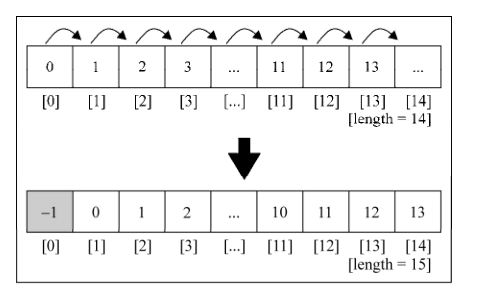
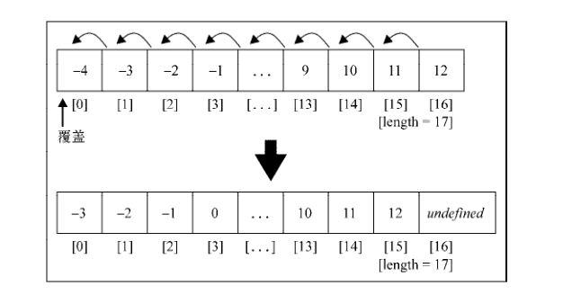
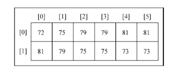

# 数组

## 1. 创建和初始化数组

-   构造函数

```js
var daysOfWeek = new Array() //{1}
var daysOfWeek = new Array(7) //{2}
var daysOfWeek = new Array(
	'Sunday',
	'Monday',
	'Tuesday',
	'Wednesday',
	'Thursday',
	'Friday',
	'Saturday'
) //{3}
```

-   字面量

```js
var daysOfWeek = []
var daysOfWeek = ['Sunday', 'Monday', 'Tuesday', 'Wednesday', 'Thursday', 'Friday', 'Saturday']
```

### 访问和迭代数组

要访问数组里特定位置的元素，可以用中括号传递数值位置，得到想知道的值或者赋新的值。
假如我们想输出数组 daysOfWeek 里的所有元素，可以通过循环遍历数组，打印元素，如下所示：

```js
for (var i = 0; i < daysOfWeek.length; i++) {
	console.log(daysOfWeek[i])
}
```

## 2. 添加元素

假如我们有一个数组 numbers ，初始化成 0 到 9：

```js
var numbers = [0, 1, 2, 3, 4, 5, 6, 7, 8, 9]
```

如果想要给数组添加一个元素（比如 10），只要把值赋给数组中最后一个空位上的元素即可。

```js
numbers[numbers.length] = 10
```

> 在 JavaScript 中，数组是一个可以修改的对象。如果添加元素，它就会动态
> 增长。在 C 和 Java 等其他语言里，我们要决定数组的大小，想添加元素就要创建
> 一个全新的数组，不能简单地往其中添加所需的元素。

### 2.1 使用 push 方法

push 方法，能把元素添加到数组的末尾：

```js
numbers.push(11)
numbers.push(12, 13)
```

### 2.2 插入元素到数组首位

现在，我们希望在数组中插入一个值，不像之前那样插入到最后，而是放到数组的首位。为
了实现这个需求，首先我们要腾出数组里第一个元素的位置，把所有的元素向右移动一位。

```js
for (var i = numbers.length; i >= 0; i--) {
	numbers[i] = numbers[i - 1]
}
numbers[0] = -1
```



-   使用 unshift 方法

unshift 方法 ，可以直接把数值插入数组的首位：

```js
numbers.unshift(-2)
numbers.unshift(-4, -3)
```

## 3. 删除元素

要删除数组里最靠后的元素，可以用 pop 方法：

```js
numbers.pop()
```

> 通过 push 和 pop 方法，就能用数组来模拟栈

### 从数组首位删除元素

如果要移除数组里的第一个元素，可以用下面的代码：

```js
for (var i = 0; i < numbers.length; i++) {
	numbers[i] = numbers[i + 1]
}
```



可以看到，我们只是把数组第一位的值用第二位覆盖了，并没有删除元素（因为数组的长度和之前还是一样的，并且了多一个未定义元素）。

**使用 shift 方法**

要确实删除数组的第一个元素，可以用 shift 方法实现：

```js
numbers.shift()
```

> 通过 shift 和 unshift 方法，就能用数组模拟基本的队列数据结构

## 4. 在任意位置添加或删除元素

可以使用 splice[MDN](https://developer.mozilla.org/zh-CN/docs/Web/JavaScript/Reference/Global_Objects/Array/splice) 方法，简单地通过指定位置/索引，就可以删除相应位置和数量的元素：

```js
numbers.splice(5, 3)
numbers.splice(5, 0, 2, 3, 4)
```

splice 方法接收的参数：

-   第一个参数，表示想要删除或插入的元素的索引值。
-   第二个参数是删除元素的个数（这个例子里，我们的目的不是删除元素，所以传入 0）。
-   第三个参数往后，就是要添加到数组里的值（元素 2、3、4）。输出会发现值又变成了从 -3 到 12。

## 5. 二维和多维数组

JavaScript 只支持一维数组，并不支持矩阵。但是，我们可以像上面的代码一样，用数组套数
组，实现矩阵或任一多维数组。

```js
var averageTemp = []
averageTemp[0] = [72, 75, 79, 79, 81, 81]
averageTemp[1] = [81, 79, 75, 75, 73, 72]
```



### 5.1 迭代二维数组的元素

_输出矩阵的值_

```js
function printMatrix(myMatrix) {
	for (var i = 0; i < myMatrix.length; i++) {
		for (var j = 0; j < myMatrix[i].length; j++) {
			console.log(myMatrix[i][j])
		}
	}
}
```

## 6.数组方法参考

| 方法名        | 描述                                                                                           |
| ------------- | ---------------------------------------------------------------------------------------------- |
| `concat`      | 连接 2 个或更多数组，并返回结果                                                                |
| `every`       | 对数组中的每一项运行给定函数，如果该函数对每一项都返回 true ，则返回 true                      |
| `filter`      | 对数组中的每一项运行给定函数，返回该函数会返回 true 的项组成的数组                             |
| `forEach`     | 对数组中的每一项运行给定函数。这个方法没有返回值                                               |
| `join`        | 将所有的数组元素连接成一个字符串                                                               |
| `indexOf`     | 返回第一个与给定参数相等的数组元素的索引，没有找到则返回-1                                     |
| `lastIndexOf` | 返回在数组中搜索到的与给定参数相等的元素的索引里最大的值                                       |
| `map`         | 对数组中的每一项运行给定函数，返回每次函数调用的结果组成的数组                                 |
| `reverse`     | 颠倒数组中元素的顺序，原先第一个元素现在变成最后一个，同样原先的最后一个元素变成了现在的第一个 |
| `slice`       | 传入索引值，将数组里对应索引范围内的元素作为新数组返回                                         |
| `some`        | 对数组中的每一项运行给定函数，如果任一项返回 true ，则返回 true                                |
| `sort`        | 按照字母顺序对数组排序，支持传入指定排序方法的函数作为参数                                     |
| `toString`    | 将数组作为字符串返回                                                                           |
| `valueOf`     | 和 toString 类似，将数组作为字符串返回                                                         |

## 7. es6 新增数组方法

| 方法         | 描述                                                                       |
| ------------ | -------------------------------------------------------------------------- |
| `@@iterator` | 返回一个包含数组键值对的迭代器对象，可以通过同步调用得到数组元素的键值对   |
| `copyWithin` | 复制数组中一系列元素到同一数组指定的起始位置                               |
| `entries`    | 返回包含数组所有键值对的 @@iterator                                        |
| `includes`   | 如果数组中存在某个元素则返回 true ，否则返回 false 。ES7 新增              |
| `find`       | 根据回调函数给定的条件从数组中查找元素，如果找到则返回该元素               |
| `findIndex`  | 根据回调函数给定的条件从数组中查找元素，如果找到则返回该元素在数组中的索引 |
| `fill`       | 用静态值填充数组                                                           |
| `from`       | 根据已有数组创建一个新数组                                                 |
| `keys`       | 返回包含数组所有索引的 @@iterator                                          |
| `of`         | 根据传入的参数创建一个新数组                                               |
| `values`     | 返回包含数组中所有值的 @@iterator                                          |

> 除了这些新的方法，还有一种用 `for...of` 循环来迭代数组的新做法，以及可以从数组实例得到的迭代器对象
